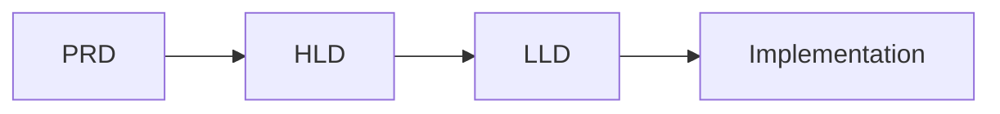
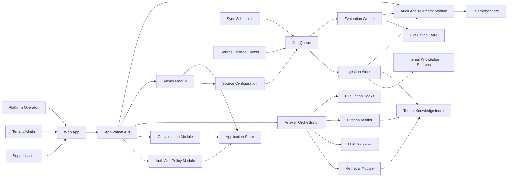
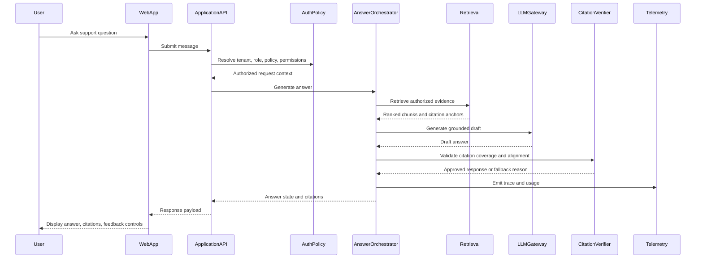
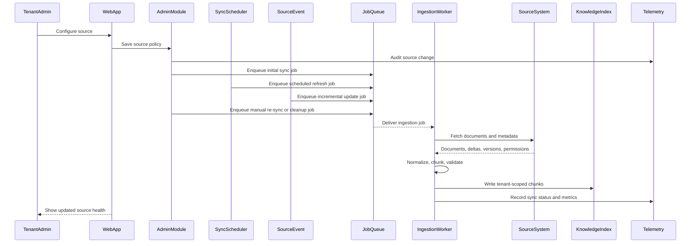
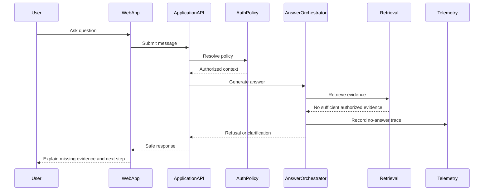
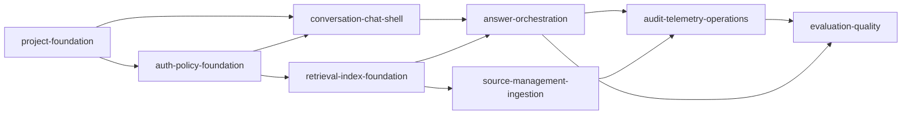

# High-Level Design: SupportLens AI

## 1. Architecture Decision Summary

SupportLens AI should use a **modular monolith with asynchronous workers** for v1.

The main application owns user-facing APIs, chat orchestration, admin workflows, authorization, conversation storage, and telemetry emission. Background workers own ingestion, indexing, source refresh, and evaluation jobs. Internal modules must have clear boundaries so they can later split into services if scale or ownership demands it.

This design is the best fit for v1 because it protects the most important product requirements from the PRD: tenant isolation, citation-backed answers, safe fallback behavior, source freshness, and operational traceability. It also avoids the operational cost of microservices before the product boundaries are proven.

## 2. Design Alternatives And Tradeoffs

### 2.1 Option A: Simple Monolith

One application handles chat, admin, ingestion, retrieval, LLM calls, authorization, telemetry, and evaluation.

Pros:

- Fastest to build.
- Simple local development and deployment.
- Fewer distributed failure modes.

Cons:

- Ingestion load can compete with chat traffic.
- Scaling is coarse-grained.
- Long-running jobs increase operational risk in the user-facing process.
- Component boundaries can blur as the codebase grows.

Decision: not recommended. It is attractive for speed, but it weakens reliability and maintainability for ingestion-heavy workloads.

### 2.2 Option B: Full Microservices

Separate services own chat, ingestion, retrieval, policy, admin, telemetry, source management, LLM gateway, and evaluation.

Pros:

- Strong deployment and scaling boundaries.
- Clear team ownership at large scale.
- Easier to isolate high-throughput components later.

Cons:

- Too much distributed complexity for v1.
- More network hops and more failure modes.
- Slower product iteration.
- Harder local development and integration testing.
- Premature service boundaries may be wrong.

Decision: not recommended for v1. It may become appropriate after traffic patterns, team boundaries, and bottlenecks are proven.

### 2.3 Option C: Modular Monolith With Async Workers

One main application owns synchronous product workflows. Separate workers handle asynchronous ingestion, indexing, evaluation, and maintenance jobs.

Pros:

- Keeps chat path independent from slow ingestion work.
- Gives strong internal boundaries without distributed-service overhead.
- Supports faster product iteration.
- Allows selected modules to split into services later.
- Fits the current uncertainty around exact scale and source mix.

Cons:

- Requires discipline to maintain module boundaries.
- Some scaling remains coupled inside the main application.
- Long-term service extraction must be planned, not accidental.

Decision: recommended for v1.

## 3. Current And Target Architecture

There is no production implementation yet. The current state is requirements-only, captured in `docs/PRD.md`.



Target v1 architecture:



## 4. Requirement Traceability

| Requirement | HLD Component | Coverage |
|---|---|---|
| FR-1, FR-2 | Web App, Application API, Conversation Module | Chat and follow-up turns |
| FR-3, FR-4 | Answer Orchestrator, Retrieval Module, LLM Gateway | Retrieval-grounded answer generation |
| FR-5, FR-6 | Citation Verifier, Citation UI, Auth And Policy Module | Citation-backed answers and source inspection |
| FR-7, FR-8, FR-9 | Answer Orchestrator, Failure Handling, Citation Verifier | Partial answers, refusals, clarifications, safe fallbacks |
| FR-10, FR-11 | Auth And Policy Module, Application Store, Tenant-scoped indexing | Tenant resolution and isolation |
| FR-12, FR-13, FR-14 | Auth And Policy Module, Retrieval Module, Citation Verifier | Role and document authorization |
| FR-15, FR-16 | Admin Module, Source Configuration | Tenant policy and source management |
| FR-17, FR-18, FR-19, FR-20 | Ingestion Worker, Tenant Knowledge Index, Source Configuration | Ingestion, metadata, freshness, re-indexing |
| FR-21, FR-22 | Feedback UI, Evaluation Hooks, Evaluation Worker | Feedback and quality signals |
| FR-23, FR-24, FR-25 | Audit And Telemetry Module, Telemetry Store, Operator Views | Monitoring, audit, traces |

| NFR | Architecture Tactic |
|---|---|
| Security, authorization, privacy | Resolve tenant and policy on every request; enforce ACL filtering before retrieval and before citation expansion |
| Reliability | Keep ingestion asynchronous; fail closed for policy and permission failures; return safe fallback states |
| Availability | Keep chat path separate from ingestion jobs; support retries and queue-based background work |
| Performance | Use tenant-scoped hybrid retrieval; support future streaming responses; track latency by stage |
| Scalability | Scale web/API and workers independently; partition indexes by tenant or tenant scope |
| Freshness | Store source version, last sync time, failure reason, and stale status in indexed metadata |
| Observability | Emit traces across policy, retrieval, model call, citation verification, answer state, and feedback |
| Auditability | Persist durable audit records for admin, policy, source, retention, and access events |
| Cost control | Meter model calls, retrieval volume, ingestion volume, chat volume, and per-tenant usage |
| Maintainability | Keep internal modules explicit and move long-running work into workers |

## 5. Component Identification

### 5.1 Web App

Responsibility: provide chatbot, citations, feedback, admin source management, and operator views.

Communication:

- Synchronous calls to Application API.
- Optional streaming channel for answer tokens or answer progress in a later pass.

Failure behavior:

- Show distinct states for service errors, permission errors, no evidence, partial evidence, and source unavailability.

### 5.2 Application API

Responsibility: provide a single product API boundary for chat, conversations, citations, feedback, source admin, policy admin, and operator workflows.

Communication:

- Synchronous request-response with Web App.
- Internal calls to modules in the same deployable application.
- Job enqueueing for async work.

Failure behavior:

- Fail closed when tenant, policy, or permissions cannot be resolved.
- Return typed safe errors for downstream failures.

### 5.3 Auth And Policy Module

Responsibility: authenticate users, resolve tenant context, load role grants, evaluate source policy, evaluate retention policy, and enforce document access rules.

Communication:

- Called synchronously by Application API before protected operations.
- Called by Retrieval Module and Citation Verifier for permission-sensitive actions.

Failure behavior:

- Deny access when authorization cannot be confidently resolved.
- Emit audit events for denials and policy decisions.

### 5.4 Conversation Module

Responsibility: store conversation metadata, messages, answer states, citation references, feedback links, and retention lifecycle metadata.

Communication:

- Synchronous internal calls from Application API and Answer Orchestrator.
- Writes audit and telemetry events through telemetry module.

Failure behavior:

- If persistence fails before answer generation, return a safe error.
- If persistence fails after generation, return answer only when policy allows and emit degraded telemetry.

### 5.5 Answer Orchestrator

Responsibility: coordinate retrieval, prompt assembly, LLM invocation, citation validation, refusal behavior, response assembly, usage metering, and trace creation.

Communication:

- Synchronous internal workflow for chat requests.
- Calls Retrieval Module, LLM Gateway, Citation Verifier, Conversation Module, and Telemetry Module.

Failure behavior:

- Retrieval unavailable: return source-search failure.
- LLM unavailable: return generation failure.
- Citation validation failed: return refusal, clarification, or partial answer.
- Policy unavailable: fail closed.

### 5.6 Retrieval Module

Responsibility: perform tenant-scoped, permission-filtered retrieval over indexed content.

Communication:

- Called synchronously by Answer Orchestrator.
- Reads from Tenant Knowledge Index.
- Calls Auth And Policy Module for ACL filters or permission context.

Failure behavior:

- If retrieval fails, do not generate an answer.
- If no sufficient evidence is found, return no-answer state.

### 5.7 LLM Gateway

Responsibility: centralize prompt policy, model calls, retries, timeouts, redaction, token accounting, and provider abstraction.

Communication:

- Called synchronously by Answer Orchestrator.
- Emits usage and error telemetry.

Failure behavior:

- Retry transient failures within latency budget.
- Return typed failure when generation cannot complete safely.

### 5.8 Citation Verifier

Responsibility: verify citations are present, authorized, resolvable, and aligned with retrieved evidence.

Communication:

- Called synchronously by Answer Orchestrator.
- Reads citation metadata from Tenant Knowledge Index.
- Calls Auth And Policy Module before citation expansion.

Failure behavior:

- Fail answer validation when citations are missing, unauthorized, or not tied to retrieved evidence.

### 5.9 Admin Module

Responsibility: manage tenant source configuration, source status, answer policy, citation policy, retention policy, and admin audit views.

Communication:

- Synchronous calls from Web App through Application API.
- Enqueues initial ingestion jobs when source configuration changes.
- Supports manual re-sync requests for existing sources.

Failure behavior:

- Validate policy before saving.
- Audit all changes.
- Roll back failed configuration changes when possible.

### 5.10 Ingestion Worker

Responsibility: fetch source documents, normalize content, chunk documents, extract metadata, resolve permissions, write indexes, and record source health.

Communication:

- Consumes initial sync, scheduled refresh, incremental update, manual re-sync, retry, permission refresh, and cleanup jobs from Job Queue.
- Calls source systems.
- Writes Tenant Knowledge Index and application metadata.

Failure behavior:

- Retry transient source failures.
- Mark source sync as failed with reason after retry exhaustion.
- Preserve last known good index if policy allows.

### 5.11 Evaluation Worker

Responsibility: run offline and scheduled quality checks for groundedness, citation correctness, retrieval relevance, refusal correctness, and regression scenarios.

Communication:

- Consumes evaluation jobs.
- Reads answer traces and evaluation datasets.
- Writes Evaluation Store and telemetry.

Failure behavior:

- Evaluation failures must not affect the chat path.
- Failed evaluations should alert operators when quality gates are breached.

### 5.12 Audit And Telemetry Module

Responsibility: collect traces, metrics, logs, audit records, feedback, usage, cost, and quality events with tenant-aware redaction.

Communication:

- Called by user-facing modules and workers.
- Writes Telemetry Store.

Failure behavior:

- Security audit events should be durable before confirming sensitive admin operations.
- Non-critical metrics can degrade without blocking user flows.

## 6. Technology Posture

Exact technology choices remain deferred. The HLD recommends categories and decision criteria:

| Area | Recommended Posture | Rationale | Tradeoff |
|---|---|---|---|
| Application shape | Modular monolith plus workers | Faster v1 with clean boundaries | Requires module discipline |
| Frontend | Server-backed web app or SPA | Supports chat, citations, admin, and operator surfaces | Exact framework deferred |
| API style | REST for admin/resources, streaming-capable chat endpoint | Simple resource APIs plus responsive chat | Streaming adds complexity when implemented |
| Worker model | Queue-backed async workers | Decouples ingestion and evaluation from chat | Queue operations required |
| Retrieval | Hybrid lexical and semantic retrieval | Handles natural language plus exact product names, errors, IDs | More ranking complexity |
| Index isolation | Tenant-scoped logical partitioning for v1 | Practical balance of isolation and cost | Some tenants may later need dedicated isolation |
| Model access | Central LLM gateway | Policy, metering, redaction, and provider abstraction in one place | Adds a hop in the answer path |
| Observability | Trace-first telemetry | Required for groundedness, debugging, audits, and cost | Must redact carefully |

## 7. Core Data Ownership

| Data Concept | Owner | Notes |
|---|---|---|
| Tenant | Auth And Policy Module | Tenant is the primary isolation boundary |
| User and Role | Auth And Policy Module | May integrate with external identity provider later |
| Policy | Auth And Policy Module, Admin Module | Includes source, citation, retention, and answer policy |
| Conversation | Conversation Module | Stores messages, answer states, citations, feedback links |
| Knowledge Source | Admin Module | Stores source config, sync settings, source-level policy |
| Source Document | Ingestion Worker | Stores normalized metadata, freshness, permissions |
| Knowledge Chunk | Ingestion Worker, Retrieval Module | Indexed content with citation anchors and ACL metadata |
| Citation | Citation Verifier, Conversation Module | Links answer claims to retrieved evidence |
| Feedback | Conversation Module, Evaluation Worker | Feeds quality and content improvement workflows |
| Audit Event | Audit And Telemetry Module | Durable for security-sensitive operations |
| Evaluation Result | Evaluation Worker | Used for quality gates and regression tracking |

## 8. Interface Contracts

These are high-level contracts, not final API specs.

### 8.1 Chat

- Submit message: accepts tenant context from auth, conversation ID when present, user message, and optional source filters allowed by policy.
- Response: returns answer state, answer text when available, citations, refusal or clarification reason, freshness warnings, trace ID, and usage metadata.
- Streaming variant: may emit progress states such as searching, generating, validating, and complete.

### 8.2 Citations

- Resolve citation: accepts answer ID and citation ID.
- Response: returns source title, source type, snippet, source link, last updated time, and access-safe denial state when applicable.

### 8.3 Feedback

- Submit feedback: accepts answer ID, feedback type, optional citation ID, optional free-text comment, and client context.
- Response: returns accepted status and feedback ID.

### 8.4 Source Admin

- Create or update source: accepts source type, connection metadata, sync policy, source policy, and permission handling mode.
- Trigger sync: accepts source ID and sync reason.
- Source health: returns last sync time, status, failure reason, indexed document count, stale content count, and permission mapping state.

### 8.5 Policy Admin

- Read or update tenant policy: includes allowed sources, citation requirement, retention policy, answer behavior, logging posture, and access review settings.

### 8.6 Operator

- Inspect health and traces: returns tenant-aware redacted metrics, errors, trace summaries, usage, cost, source health, and quality signals.

## 9. Primary Data Flows

### 9.1 Answer Flow



### 9.2 Ingestion Trigger And Sync Flow

Ingestion is not limited to tenant admin source configuration. Source configuration creates the initial sync job, but ongoing freshness depends on scheduled refreshes, source change events, incremental deltas, manual re-syncs, retries, permission refreshes, and cleanup jobs.



### 9.3 Failure Flow



## 10. Authorization And Tenant Isolation

Tenant isolation is enforced in every request and background job.

Required tactics:

- Resolve tenant context before loading user data, source data, conversations, indexes, traces, or policies.
- Store tenant ID on every tenant-owned record.
- Apply tenant filters in all reads and writes.
- Apply document ACL filters before retrieval.
- Re-check authorization before citation expansion.
- Treat unresolved permissions as deny by default.
- Audit source policy changes, admin changes, access denials, and retention changes.
- Redact tenant-sensitive text in telemetry according to tenant policy.

For v1, tenant-scoped logical partitioning is acceptable. The design should leave room for dedicated tenant indexes or stores for regulated or high-scale tenants later.

## 11. Retrieval And Grounding Strategy

Recommended retrieval strategy: hybrid retrieval.

Why:

- Support questions often include exact identifiers, error codes, product names, feature names, and procedure names.
- Semantic retrieval handles natural-language paraphrases.
- Lexical retrieval handles exact terms that embeddings can dilute.
- Ranking can combine both signals before answer generation.

Grounding rules:

- Do not generate substantive answers without retrieved authorized evidence.
- Include citation anchors in the evidence passed to the LLM.
- Validate that final citations refer to retrieved chunks.
- Return refusal, clarification, or partial answer when evidence is insufficient.
- Show freshness warnings when source metadata indicates stale content and policy allows use of stale content.

## 12. Observability And Audit Design

Every answer trace should connect:

- request ID
- tenant ID
- user role
- policy version
- conversation ID
- retrieval query
- retrieved source IDs
- retrieval scores
- model call metadata
- citation validation result
- answer state
- latency breakdown
- usage and cost metadata
- feedback when available

Audit events are required for:

- source create, update, disable, delete
- policy changes
- retention changes
- admin role changes
- access denials
- permission mapping failures
- source sync state changes when security-relevant

Telemetry must distinguish security audit events from operational metrics. Security audit events should be durable before confirming sensitive changes. Operational metrics may degrade without blocking non-sensitive user flows.

## 13. NFR Architecture

| NFR | Target Tactic | Validation |
|---|---|---|
| Security | Tenant ID on all tenant data; fail-closed policy checks | Isolation and authorization tests |
| Privacy | Redaction and retention policy in telemetry and conversations | Retention and logging review |
| Reliability | Async ingestion; typed fallback states | Fault injection |
| Availability | Chat path independent from ingestion workers | Dependency outage tests |
| Performance | Hybrid retrieval, latency tracing, future streaming support | Load and latency tests |
| Scalability | Separate API and worker scaling | Capacity tests |
| Freshness | Source sync metadata and stale indicators | Admin source health tests |
| Observability | Trace every answer across key stages | Trace completeness checks |
| Auditability | Durable audit events for sensitive actions | Audit log review |
| Quality | Evaluation worker and curated eval sets | Groundedness and citation evaluation |
| Cost control | Tenant-level usage and model metering | Usage report review |
| Maintainability | Explicit module ownership | Architecture review |

## 14. Deployment And Migration Strategy

Because this is a greenfield application, migration means phased rollout rather than replacing a live system.

### Phase 1: Foundation

- Create project structure.
- Add Web App shell.
- Add Application API shell.
- Add tenant, auth, policy, conversation, telemetry, and admin module boundaries.
- Add local development and test harness.

Rollback:

- No production traffic yet; rollback by reverting deployment or disabling environment.

### Phase 2: Core Chat

- Implement authenticated chat.
- Implement conversation persistence.
- Implement retrieval over a small approved test corpus.
- Add Answer Orchestrator, LLM Gateway, Citation Verifier, and answer states.

Rollback:

- Disable chat feature flag.
- Preserve conversations for debugging if retention policy allows.

### Phase 3: Ingestion

- Add source configuration.
- Add ingestion queue and worker.
- Add initial sync, scheduled refresh, incremental update, manual re-sync, retry, permission refresh, and cleanup job types.
- Add source health views.
- Add re-indexing, freshness tracking, and sync failure reporting.

Rollback:

- Disable source sync jobs.
- Continue serving last known good index if policy allows.

### Phase 4: Admin, Audit, And Operations

- Add admin policy management.
- Add audit views.
- Add operator telemetry views.
- Add retention, deletion, export, and access review workflows.

Rollback:

- Disable admin mutation endpoints except emergency controls.
- Preserve audit events.

### Phase 5: Quality And Scale

- Add evaluation worker.
- Add offline evaluation sets.
- Add quality regression gates.
- Improve retrieval ranking, latency, and cost controls.

Rollback:

- Disable evaluation gates while continuing passive telemetry.

## 15. Work Unit Decomposition

```yaml
- unit-id: project-foundation
  repo: SupportLens-AI
  description: Create application skeleton, docs structure, development scripts, and module boundaries.
  files: [docs/HLD.md, docs/LLD.md, apps/web, apps/api, workers]
  deps: []
  tier: small
  acceptance: [Project structure supports web app, API app, workers, and shared modules.]
  tests: [Repository health check, basic build or lint once stack is selected.]

- unit-id: auth-policy-foundation
  repo: SupportLens-AI
  description: Define tenant context, role model, source policy, retention policy, and authorization enforcement points.
  files: [apps/api/auth-policy, apps/api/admin, apps/api/shared]
  deps: [project-foundation]
  tier: medium
  acceptance: [Every protected operation resolves tenant and policy before data access.]
  tests: [Tenant isolation tests, role access tests, deny-by-default tests.]

- unit-id: conversation-chat-shell
  repo: SupportLens-AI
  description: Build chat UI shell, conversation module, message persistence, and answer state model.
  files: [apps/web/chat, apps/api/conversation]
  deps: [project-foundation, auth-policy-foundation]
  tier: medium
  acceptance: [User can start and continue a tenant-scoped conversation.]
  tests: [Conversation API tests, UI state tests.]

- unit-id: retrieval-index-foundation
  repo: SupportLens-AI
  description: Define tenant knowledge index abstraction, chunk metadata, citation anchors, and hybrid retrieval interface.
  files: [apps/api/retrieval, apps/api/index]
  deps: [auth-policy-foundation]
  tier: medium
  acceptance: [Retrieval returns only tenant-authorized chunks with citation metadata.]
  tests: [Retrieval relevance tests, ACL prefilter tests.]

- unit-id: answer-orchestration
  repo: SupportLens-AI
  description: Build answer workflow across retrieval, LLM gateway, citation verification, fallback states, and telemetry.
  files: [apps/api/answer, apps/api/llm-gateway, apps/api/citation]
  deps: [conversation-chat-shell, retrieval-index-foundation]
  tier: large
  acceptance: [Substantive answers include validated citations or return refusal, partial answer, clarification, or safe error.]
  tests: [Grounded answer tests, no-evidence refusal tests, citation validation tests.]

- unit-id: source-management-ingestion
  repo: SupportLens-AI
  description: Add source admin workflow, ingestion queue, ingestion worker, source health, and re-indexing.
  files: [apps/api/source-management, workers/ingestion, apps/web/admin]
  deps: [retrieval-index-foundation]
  tier: large
  acceptance: [Tenant admin can configure a source and see sync status, failures, and indexed counts.]
  tests: [Ingestion job tests, source health tests, failure retry tests.]

- unit-id: audit-telemetry-operations
  repo: SupportLens-AI
  description: Add answer traces, audit events, usage metering, operator health views, and tenant-aware redaction.
  files: [apps/api/telemetry, apps/web/operator]
  deps: [answer-orchestration, source-management-ingestion]
  tier: medium
  acceptance: [Operators can trace answer flow and audit sensitive actions.]
  tests: [Trace completeness tests, audit event tests, redaction tests.]

- unit-id: evaluation-quality
  repo: SupportLens-AI
  description: Add feedback capture, evaluation worker, offline eval sets, and quality regression reporting.
  files: [apps/api/evaluation, workers/evaluation, apps/web/feedback]
  deps: [answer-orchestration, audit-telemetry-operations]
  tier: medium
  acceptance: [System reports groundedness, citation correctness, retrieval relevance, and refusal behavior.]
  tests: [Evaluation scenario tests, feedback capture tests.]
```

## 16. Dependency Graph



## 17. Risks And Mitigations

| Risk | Likelihood | Impact | Mitigation | Rollback |
|---|---|---|---|---|
| Cross-tenant data leakage | Medium | High | Tenant filters on all data, ACL prefiltering, citation recheck, isolation tests | Disable affected tenant or source; revoke index; audit access |
| Hallucinated or uncited answers | Medium | High | Require retrieval evidence, citation verifier, refusal thresholds, quality evals | Disable answer generation; return search-only results |
| Source permission mismatch | Medium | High | Preserve ACLs where available; deny unresolved permissions; allow tenant-shared sources only by policy | Disable source; purge affected chunks |
| Stale content answers | Medium | Medium | Store freshness metadata; show warnings; allow policy-based stale serving | Disable stale source or force re-index |
| High latency | Medium | Medium | Stage-level tracing, hybrid retrieval tuning, async ingestion, future streaming | Disable expensive sources or cap retrieval depth |
| Cost growth | Medium | Medium | Tenant metering, model usage tracking, quotas, prompt limits | Apply tenant quota or disable costly workflows |
| Module boundary erosion | Medium | Medium | Architecture reviews, module ownership, interface contracts | Refactor before scaling into services |

## 18. Open HLD Questions

These do not block the HLD, but should be answered before LLD:

- Which source types are mandatory for v1: wiki, runbooks, product docs, knowledge base articles, curated FAQs, or ticket history?
- What exact answer latency target defines an interactive response window?
- Should sources without document-level ACLs be allowed as tenant-shared sources by default, or excluded unless explicitly approved?
- What retention windows apply to conversations, retrieved snippets, traces, feedback, and audit events?
- What initial scale should the LLD design for: tenant count, document count, chunk count, and concurrent users?

## 19. HLD Acceptance Criteria

- The selected architecture explicitly documents alternatives and tradeoffs.
- Chat serving is separated from ingestion and evaluation work.
- Tenant isolation and authorization are enforced before retrieval and citation expansion.
- Substantive answers require retrieved evidence and validated citations.
- Failure modes produce safe errors, refusals, clarifications, or partial answers.
- Source freshness, ingestion health, telemetry, audit, and quality evaluation are first-class design concerns.
- Work units form an acyclic dependency graph suitable for LLD and implementation planning.
