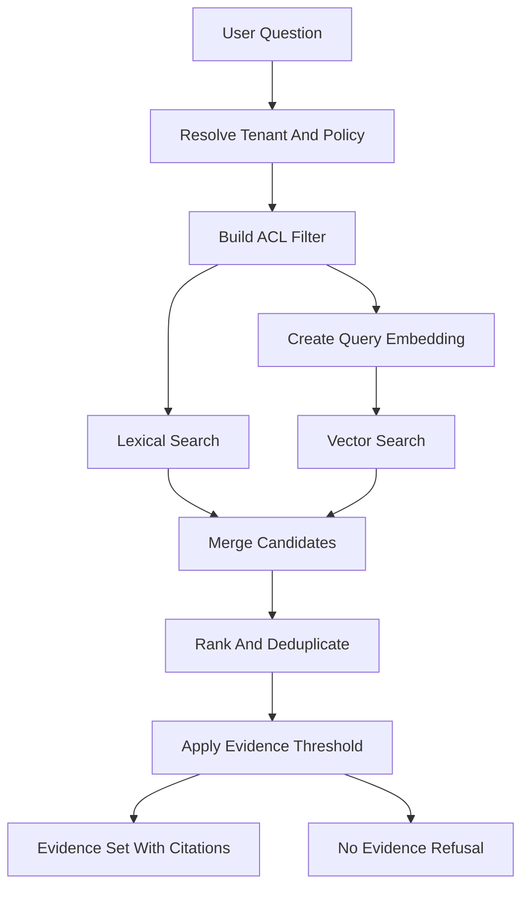

# Low-Level Design: SupportLens AI

## 1. Implementation Overview

SupportLens AI v1 will be implemented as a modular application with a **Next.js frontend**, a **Python API backend**, and **Python background workers**. The design targets up to **10,000 users** and up to **10,000 internal documentation pages**, where each page is approximately **20KB to 50KB**.

The v1 implementation should stay simple and cost-conscious:

- One frontend app: `apps/web` using Next.js.
- One backend API app: `apps/api` using Python FastAPI.
- One worker package: `workers` using Python workers.
- One primary datastore: PostgreSQL with `pgvector`, full-text search, and trigram search.
- One queue layer: Redis Queue with Redis.
- One local LLM runtime: Ollama.
- One LLM proxy: LiteLLM proxy in front of Ollama.
- One local embedding runtime: `sentence-transformers`.
- One LLM Gateway module that calls LiteLLM and keeps RAG orchestration custom and explicit.

Scale estimate:

- Raw source text: 200MB to 500MB.
- Chunk count: likely 40,000 to 150,000 chunks depending on chunk size and overlap.
- Embedding storage: manageable in PostgreSQL for v1.
- Query volume: sized for internal support usage, not public internet traffic.
- MVP cost posture: use open-source software running locally or on existing compute. Avoid paid hosted LLMs, managed vector databases, managed search, managed queues, and paid auth services for the MVP.
- Future split points: dedicated vector DB, OpenSearch, object storage for raw documents, separate ingestion service, heavier queue infrastructure, hosted LLMs, and advanced LLM orchestration.

## 2. Technology Choices

### 2.1 Frontend

| Option | Pros | Cons | Fit |
|---|---|---|---|
| Next.js | Strong React ecosystem, routing conventions, good app structure, supports chat/admin/operator screens, future SSR if needed | More framework surface than a plain SPA, must keep backend logic in Python API | Recommended |
| React SPA with Vite | Simple, cheap static hosting, fast local development | More manual routing/data conventions, less built-in app structure | Good fallback |
| Server-rendered templates | Very simple infrastructure, low JavaScript complexity | Weak chat interactivity, less ergonomic admin/operator UX | Not ideal |
| Admin template framework | Fast admin screens | Can constrain UX, may diverge from chat needs | Useful for internal admin only |

Recommendation: **Next.js**. Keep it as a client-facing web app and call the Python API for business logic. Avoid putting core backend logic in Next.js server routes.

### 2.2 Backend

| Option | Pros | Cons | Fit |
|---|---|---|---|
| FastAPI | Strong async support, simple API contracts, Python AI ecosystem, good OpenAPI support | Requires discipline for module boundaries | Recommended |
| Django plus DRF | Batteries included, admin/auth patterns, mature ORM | Heavier for chat/RAG workflow, more framework assumptions | Good if admin CRUD dominates |
| Flask | Minimal and flexible | More manual structure and validation | Too light for this app |
| Node.js Fastify | Fast and lightweight | User requested Python backend, weaker Python AI library fit | Not selected |

Recommendation: **FastAPI** with explicit domain modules. Use Pydantic schemas for request/response contracts and SQLAlchemy or SQLModel for persistence.

### 2.3 Database And Metadata Store

| Option | Pros | Cons | Fit |
|---|---|---|---|
| PostgreSQL with `pgvector`, full-text, trigram | One free open-source datastore, supports app data and v1 retrieval, simpler ops | Search/vector may need split later | Recommended |
| PostgreSQL only without `pgvector` | Cheapest and simplest | No semantic retrieval | Insufficient for RAG quality |
| PostgreSQL plus OpenSearch | Strong lexical search and filtering | Extra infrastructure and sync complexity | Later if search quality requires it |
| Managed vector DB | Strong vector operations, easy scale | Extra cost and vendor dependency | Not selected for free MVP |
| Qdrant/Weaviate/Milvus | Good vector capabilities, open-source options | Additional service to operate | Later if pgvector bottlenecks |

Recommendation: **PostgreSQL with `pgvector`, full-text search, and trigram search**. It is adequate for 10,000 pages and keeps v1 inexpensive.

### 2.4 Queue And Workers

| Option | Pros | Cons | Fit |
|---|---|---|---|
| RQ with Redis | Simple Python jobs, easy retries, low ceremony | Less feature-rich than Celery | Recommended for v1 if workflows stay simple |
| Celery with Redis | Mature, scheduling, retries, routing, concurrency | More operational complexity | Recommended if scheduled jobs and retries get complex |
| Dramatiq | Clean Python worker model | Smaller ecosystem than Celery | Good alternative |
| APScheduler plus DB jobs | Minimal infrastructure | Harder distributed execution and retries | Only for tiny deployments |
| Managed cloud queues | Durable and scalable | Provider coupling and more setup | Good later |

Recommendation: **RQ with Redis** for simple v1 jobs. Redis and RQ are free and simple enough for ingestion refreshes, retries, and evaluation jobs. Use Celery only if routing and scheduling complexity grows.

### 2.5 LLM Integration

| Option | Pros | Cons | Fit |
|---|---|---|---|
| LiteLLM proxy with Ollama backend | Free local/self-hosted path, OpenAI-compatible API, easy model/provider switching later, central retry and usage hooks | Adds one local proxy process and config file | Recommended for free MVP |
| Ollama direct API | Free local/self-hosted LLM runtime, no paid API dependency, simple HTTP integration | Harder to switch providers/models cleanly later | Not selected |
| Direct hosted provider SDKs | Minimal dependencies, full control | Paid usage and vendor-specific code | Not selected for free MVP |
| LiteLLM library in API process | Provider abstraction without separate proxy | Couples provider config to API deployment | Acceptable alternative |
| LangChain | Large ecosystem, many integrations | Can add abstraction weight and version churn | Useful for specific integrations, not core required |
| LangGraph | Strong stateful workflow orchestration | More complex than v1 RAG needs | Future if agentic workflows grow |
| LlamaIndex | Strong document/RAG abstractions | Can overlap with custom retrieval design | Consider for ingestion/RAG experiments |
| Haystack | Mature search/RAG pipelines | More framework weight | Consider if pipelines become complex |
| Semantic Kernel | Good planner/plugin concepts | More useful for multi-skill agent workflows | Not needed for v1 |
| Custom orchestration | Precise control and low overhead | More code to maintain | Recommended with LiteLLM proxy |

Recommendation: **LiteLLM proxy with Ollama backend plus custom orchestration**. The Python API should call the LiteLLM proxy using an OpenAI-compatible interface, while LiteLLM routes to local Ollama models for the free MVP. Keep retrieval, prompt assembly, citation verification, and refusal logic explicit in `apps/api/app/modules/answer`. Good MVP models to evaluate locally include `llama3.1:8b`, `mistral`, and `qwen2.5`.

### 2.6 Embeddings

| Option | Pros | Cons | Fit |
|---|---|---|---|
| `sentence-transformers` local model | Free, local, no paid API dependency, easy Python integration | Slower than hosted APIs on weak hardware | Recommended for free MVP |
| Ollama embeddings | Single local runtime for LLM and embeddings | Model selection and quality may be more limited | Good alternative |
| Hosted embedding API | Fastest to integrate, no model hosting | Ongoing cost and data handling review | Not selected for free MVP |
| Open-source embedding service hosted internally | More control and scalable serving | More setup than in-process embeddings | Later if ingestion volume grows |

Recommendation: use **`sentence-transformers` locally behind an Embedding Gateway**. Start with `all-MiniLM-L6-v2` for the fastest MVP, then evaluate stronger free models such as BGE or E5 if retrieval quality is not good enough. Store model name and embedding version on chunks so re-embedding can be managed.

### 2.7 Auth

| Option | Pros | Cons | Fit |
|---|---|---|---|
| OIDC/SAML identity provider integration | Enterprise friendly, avoids password handling | Requires IdP setup | Future production path |
| Built-in username/password | Free, full control, enough for local MVP | Security burden, not ideal for production | Recommended for MVP only |
| Keycloak | Free OIDC/SAML, production-capable | Heavier to run and configure | Good free production path |
| Auth0/Clerk style SaaS | Fast setup | Vendor dependency and cost | Not selected for free MVP |

Recommendation: use **built-in local auth for MVP only** to avoid paid auth services and reduce setup. Keep the auth boundary compatible with future OIDC/SAML or Keycloak. For a more production-like free setup, use Keycloak.

### 2.8 Observability

| Option | Pros | Cons | Fit |
|---|---|---|---|
| Structured logs plus PostgreSQL audit tables | Free, simple, enough for MVP debugging and audit | Limited dashboards and alerting | Recommended for free MVP |
| OpenTelemetry plus local Prometheus/Grafana | Standard, portable, trace-friendly, free self-hosted option | More setup | Recommended after MVP baseline |
| Sentry only | Great app errors | Not enough for retrieval/model traces, paid tiers may apply | Partial |
| Custom DB-only logs | Cheap | Poor operational visibility | Not enough |

Recommendation: start with **structured logs plus PostgreSQL audit and trace tables**. Add OpenTelemetry with local Prometheus/Grafana when the MVP needs dashboards.

### 2.9 Deployment

| Option | Pros | Cons | Fit |
|---|---|---|---|
| Docker Compose | Free, simple local MVP, runs web/API/workers/Postgres/Redis/LiteLLM/Ollama together | Single-host, not highly available | Recommended for free MVP |
| Containerized web/API/workers | Portable, simple scaling | Requires container platform | Later production path |
| Serverless API | Easy scale-to-zero | Streaming, long-running calls, workers can be awkward | Not preferred |
| Single VM | Cheapest/simple | Less resilient and harder to scale | Acceptable dev only |

Recommendation: **Docker Compose** for MVP, with separate containers for Next.js web, FastAPI API, Python workers, PostgreSQL, Redis, LiteLLM proxy, and Ollama. Move to a container platform later only if needed.

### 2.10 Storage

| Option | Pros | Cons | Fit |
|---|---|---|---|
| Store normalized text in PostgreSQL | Simple and searchable | DB grows with raw content | Recommended for v1 scale |
| Object storage for raw docs plus DB metadata | Better for large files and retention | Extra service | Future split point |
| Source-only storage | Minimal storage | Harder audits, re-indexing, source outages | Not recommended |

Recommendation: store normalized text and chunk text in PostgreSQL for v1. Add object storage later if raw document retention or file size grows.

## 3. Repository Structure

| Path | Purpose |
|---|---|
| `apps/web` | Next.js frontend for chat, citations, admin, and operator views |
| `apps/web/app` | App routes and layouts |
| `apps/web/components` | Reusable UI components |
| `apps/web/features/chat` | Chat UI, message composer, answer card, citation panel |
| `apps/web/features/admin` | Source, policy, retention, and tenant admin screens |
| `apps/web/features/operator` | Health, trace, usage, and quality dashboards |
| `apps/api` | FastAPI backend application |
| `apps/api/app/main.py` | API app entrypoint |
| `apps/api/app/modules/auth_policy` | Tenant, role, permission, policy enforcement |
| `apps/api/app/modules/conversation` | Conversation, messages, answers, feedback |
| `apps/api/app/modules/answer` | Answer orchestration workflow |
| `apps/api/app/modules/retrieval` | Hybrid retrieval and ranking |
| `apps/api/app/modules/llm_gateway` | LiteLLM client and local embedding gateway |
| `apps/api/app/modules/citation` | Citation validation and citation expansion |
| `apps/api/app/modules/source_management` | Source config, sync policy, source health |
| `apps/api/app/modules/telemetry` | Audit events, traces, usage, cost metrics |
| `apps/api/app/modules/evaluation` | Evaluation datasets and result APIs |
| `apps/api/app/db` | Models, migrations, session management |
| `workers/ingestion` | Source sync, chunking, embedding, indexing jobs |
| `workers/evaluation` | Groundedness, citation, retrieval, refusal evaluations |
| `workers/scheduler` | Scheduled refresh and retry enqueueing |
| `packages/contracts` | Shared OpenAPI-generated TypeScript client or schema snapshots |
| `docs` | PRD, HLD, LLD, later ADRs and runbooks |

## 4. Per-Work-Unit Specification

### WU-1: project-foundation

| Files to Create or Modify | Purpose |
|---|---|
| `apps/web` | Next.js app shell |
| `apps/api/app/main.py` | FastAPI app entrypoint |
| `apps/api/app/core/config.py` | Environment and settings |
| `apps/api/app/db/session.py` | Database session lifecycle |
| `workers/ingestion/main.py` | Ingestion worker entrypoint |
| `workers/evaluation/main.py` | Evaluation worker entrypoint |
| `docs/LLD.md` | Low-level design |

| Function | File | Params | Returns |
|---|---|---|---|
| `create_app` | `apps/api/app/main.py` | settings | FastAPI app |
| `get_settings` | `apps/api/app/core/config.py` | none | Settings |
| `get_db_session` | `apps/api/app/db/session.py` | request context | DB session |

Acceptance criteria:

- App, API, and worker folders exist with clear ownership.
- API exposes health endpoint.
- Settings support database, Redis, LiteLLM proxy, Ollama model routing, local embedding model, and telemetry config.

Tests:

| Test | Type | Verifies |
|---|---|---|
| API health test | Integration | FastAPI app starts |
| Settings test | Unit | Required config validation |

### WU-2: auth-policy-foundation

| Files to Create or Modify | Purpose |
|---|---|
| `apps/api/app/modules/auth_policy/models.py` | Tenant, user, role, policy models |
| `apps/api/app/modules/auth_policy/service.py` | Tenant and policy resolution |
| `apps/api/app/modules/auth_policy/dependencies.py` | FastAPI auth dependencies |
| `apps/api/app/modules/auth_policy/schemas.py` | Request context and policy schemas |

| Function | File | Params | Returns |
|---|---|---|---|
| `resolve_request_context` | `auth_policy/service.py` | auth claims, request metadata | RequestContext |
| `require_role` | `auth_policy/dependencies.py` | allowed roles | dependency result |
| `build_document_acl_filter` | `auth_policy/service.py` | request context, source IDs | ACL filter |
| `enforce_tenant_scope` | `auth_policy/service.py` | tenant ID, resource tenant ID | allow or deny |

Data model changes:

| Entity | Key Fields |
|---|---|
| `tenants` | id, name, status, retention policy, created at |
| `users` | id, external subject, email, display name, status |
| `tenant_memberships` | tenant id, user id, role, status |
| `tenant_policies` | tenant id, citation required, retention settings, logging posture |

Acceptance criteria:

- Every protected route resolves tenant context.
- Document access fails closed when permissions are unresolved.
- Tenant isolation tests cover reads, writes, citations, traces, and admin operations.

### WU-3: conversation-chat-shell

| Files to Create or Modify | Purpose |
|---|---|
| `apps/web/features/chat` | Chat UI components |
| `apps/api/app/modules/conversation/routes.py` | Conversation API routes |
| `apps/api/app/modules/conversation/service.py` | Conversation persistence |
| `apps/api/app/modules/conversation/schemas.py` | Conversation schemas |

| API Method | Route | Request Fields | Response Fields | Errors |
|---|---|---|---|---|
| POST | `/v1/conversations` | title optional | conversation id, title, created at | unauthorized |
| GET | `/v1/conversations` | pagination | conversations | unauthorized |
| GET | `/v1/conversations/{id}` | none | messages, answers, citations | not found, forbidden |

Data model changes:

| Entity | Key Fields |
|---|---|
| `conversations` | id, tenant id, user id, title, status, created at, retention expires at |
| `messages` | id, conversation id, role, content, created at |
| `answers` | id, conversation id, message id, answer state, text, trace id, model metadata |

Acceptance criteria:

- Users can start and resume tenant-scoped conversations.
- Users cannot access other tenants' conversations.
- Chat UI renders empty, loading, answer, refusal, partial, and error states.

### WU-4: retrieval-index-foundation

| Files to Create or Modify | Purpose |
|---|---|
| `apps/api/app/modules/retrieval/service.py` | Hybrid retrieval workflow |
| `apps/api/app/modules/retrieval/ranking.py` | Candidate merge and scoring |
| `apps/api/app/modules/retrieval/schemas.py` | Retrieval request/result schemas |
| `apps/api/app/modules/source_management/models.py` | Source and document metadata models |
| `workers/ingestion/chunking.py` | Chunking policy |

| Function | File | Params | Returns |
|---|---|---|---|
| `retrieve_evidence` | `retrieval/service.py` | request context, query, options | EvidenceSet |
| `lexical_search` | `retrieval/service.py` | tenant id, query, ACL filter | candidate chunks |
| `vector_search` | `retrieval/service.py` | tenant id, embedding, ACL filter | candidate chunks |
| `merge_and_rank` | `retrieval/ranking.py` | lexical candidates, vector candidates | ranked chunks |
| `chunk_document` | `workers/ingestion/chunking.py` | document text, metadata | chunks |

Data model changes:

| Entity | Key Fields |
|---|---|
| `knowledge_sources` | id, tenant id, type, name, status, sync policy, permission mode |
| `source_documents` | id, tenant id, source id, external id, title, url, version, last modified, freshness status |
| `knowledge_chunks` | id, tenant id, source id, document id, chunk index, text, citation anchor, ACL metadata |
| `chunk_embeddings` | chunk id, tenant id, embedding model, embedding version, vector |

Retrieval defaults:

- Chunk target: 800 to 1,200 tokens.
- Chunk overlap: 100 to 150 tokens.
- Candidate pool: lexical top 50 plus vector top 50.
- Final context: 5 to 10 chunks depending on token budget.
- Refusal threshold: no answer when top candidates fail minimum relevance and source freshness policy.

Acceptance criteria:

- Retrieval prefilters by tenant and ACL.
- Returned chunks include citation anchors and freshness metadata.
- Hybrid retrieval can find exact error codes and paraphrased questions.

### WU-5: answer-orchestration

| Files to Create or Modify | Purpose |
|---|---|
| `apps/api/app/modules/answer/routes.py` | Chat answer routes |
| `apps/api/app/modules/answer/service.py` | Answer orchestration |
| `apps/api/app/modules/answer/prompts.py` | Prompt templates and policies |
| `apps/api/app/modules/llm_gateway/service.py` | LiteLLM proxy calls and local embedding calls |
| `apps/api/app/modules/citation/service.py` | Citation validation |

| API Method | Route | Request Fields | Response Fields | Errors |
|---|---|---|---|---|
| POST | `/v1/chat/messages` | conversation id optional, message, source filters optional | answer state, answer text, citations, trace id | forbidden, no evidence, model unavailable |
| GET | `/v1/answers/{id}` | none | answer, citations, state, feedback summary | not found, forbidden |

| Function | File | Params | Returns |
|---|---|---|---|
| `generate_answer` | `answer/service.py` | request context, message request | AnswerResponse |
| `build_grounded_prompt` | `answer/prompts.py` | question, conversation context, evidence | PromptBundle |
| `call_model` | `llm_gateway/service.py` | prompt bundle, model options | ModelResult |
| `embed_texts` | `llm_gateway/service.py` | text list, embedding options | embedding vectors |
| `validate_citations` | `citation/service.py` | draft answer, evidence set | CitationValidationResult |
| `classify_answer_state` | `answer/service.py` | evidence, validation result, errors | AnswerState |

Answer states:

- `answered`
- `partial`
- `clarification_required`
- `refused_no_evidence`
- `refused_unauthorized`
- `source_unavailable`
- `model_unavailable`
- `citation_validation_failed`

Acceptance criteria:

- Substantive answers include validated citations.
- Missing or weak evidence produces refusal or clarification.
- LLM failures never produce hallucinated fallback answers.

### WU-6: source-management-ingestion

| Files to Create or Modify | Purpose |
|---|---|
| `apps/api/app/modules/source_management/routes.py` | Source admin APIs |
| `apps/api/app/modules/source_management/service.py` | Source config and health |
| `workers/ingestion/jobs.py` | Ingestion job handlers |
| `workers/ingestion/connectors` | Source connector interfaces |
| `workers/scheduler/sync_scheduler.py` | Scheduled refresh enqueueing |

| API Method | Route | Request Fields | Response Fields | Errors |
|---|---|---|---|---|
| POST | `/v1/admin/sources` | source type, name, connection ref, sync policy, permission mode | source id, status | invalid config, forbidden |
| PATCH | `/v1/admin/sources/{id}` | mutable source fields | source status | not found, forbidden |
| POST | `/v1/admin/sources/{id}/sync` | sync reason | job id, status | not found, already queued |
| GET | `/v1/admin/sources/{id}/health` | none | last sync, status, counts, failures, freshness | not found |
| DELETE | `/v1/admin/sources/{id}` | delete mode | cleanup job id | forbidden, retention blocked |

Worker job types:

| Job | Trigger | Purpose |
|---|---|---|
| `initial_sync` | source create or enable | Ingest source for first time |
| `scheduled_refresh` | scheduler | Detect changed docs and permissions |
| `incremental_update` | source event or delta cursor | Apply source changes quickly |
| `manual_resync` | tenant admin | Force refresh |
| `retry_failed_sync` | retry policy | Retry transient failures |
| `permission_refresh` | schedule or admin | Refresh ACL metadata |
| `cleanup_source` | disable/delete source | Remove or exclude indexed chunks |

Acceptance criteria:

- Admin source changes enqueue the correct job.
- Scheduled refresh and incremental updates update stale content.
- Failed syncs preserve last known good index when policy allows.

### WU-7: audit-telemetry-operations

| Files to Create or Modify | Purpose |
|---|---|
| `apps/api/app/modules/telemetry/service.py` | Trace and audit writes |
| `apps/api/app/modules/telemetry/routes.py` | Operator trace APIs |
| `apps/web/features/operator` | Operator dashboards |

| API Method | Route | Request Fields | Response Fields | Errors |
|---|---|---|---|---|
| GET | `/v1/operator/traces/{trace_id}` | none | redacted trace stages | not found, forbidden |
| GET | `/v1/operator/usage` | tenant, date range | chat, ingestion, model, retrieval usage | forbidden |
| GET | `/v1/operator/health` | filters | service, source, queue, quality health | forbidden |

Data model changes:

| Entity | Key Fields |
|---|---|
| `audit_events` | id, tenant id, actor id, action, resource type, resource id, created at |
| `answer_traces` | id, tenant id, conversation id, stages, latency, answer state, redaction status |
| `usage_events` | id, tenant id, event type, quantity, cost metadata, created at |

Acceptance criteria:

- Sensitive admin changes write durable audit events.
- Answer traces connect policy, retrieval, model call, citation validation, and answer state.
- Operator APIs apply tenant-aware redaction.

### WU-8: evaluation-quality

| Files to Create or Modify | Purpose |
|---|---|
| `apps/api/app/modules/evaluation/routes.py` | Evaluation result APIs |
| `apps/api/app/modules/evaluation/service.py` | Evaluation metadata |
| `workers/evaluation/jobs.py` | Evaluation job handlers |
| `apps/web/features/feedback` | User feedback controls |

| Function | File | Params | Returns |
|---|---|---|---|
| `submit_feedback` | `conversation/service.py` | request context, feedback payload | FeedbackRecord |
| `run_groundedness_eval` | `workers/evaluation/jobs.py` | evaluation job | EvaluationResult |
| `run_citation_eval` | `workers/evaluation/jobs.py` | evaluation job | EvaluationResult |
| `run_retrieval_eval` | `workers/evaluation/jobs.py` | evaluation job | EvaluationResult |

Data model changes:

| Entity | Key Fields |
|---|---|
| `feedback` | id, tenant id, answer id, citation id optional, type, comment, created at |
| `evaluation_sets` | id, tenant id, name, scenario count, status |
| `evaluation_results` | id, tenant id, evaluation set id, metric, score, run metadata |

Acceptance criteria:

- Users can submit answer and citation feedback.
- Evaluation jobs do not block chat.
- Quality metrics include groundedness, citation correctness, retrieval relevance, and refusal correctness.

## 5. Retrieval Algorithm

Retrieval steps:

1. Resolve tenant, user, roles, source policy, and document ACL filter.
2. Normalize the user question.
3. Run PostgreSQL full-text/trigram lexical search with tenant and ACL filters.
4. Generate query embedding through the local Embedding Gateway.
5. Run `pgvector` similarity search with tenant and ACL filters.
6. Merge candidates by source, score, freshness, and diversity.
7. Deduplicate overlapping chunks.
8. Apply evidence threshold.
9. Return evidence with citation anchors.

## 6. Error Handling Strategy

| Module | Error Types | Propagation | User-Facing Message | Internal Log |
|---|---|---|---|---|
| Auth Policy | missing tenant, forbidden role, unresolved ACL | fail closed | Access denied | actor, tenant, action |
| Retrieval | no evidence, index unavailable | answer state | I could not find enough authorized evidence | trace stage, query, counts |
| LLM Gateway | timeout, LiteLLM unavailable, Ollama unavailable, model load error | answer state | Answer generation is temporarily unavailable | model, latency, proxy status, local runtime status |
| Citation | missing citation, unauthorized citation | answer state | I cannot provide a supported answer | answer id, citation ids |
| Ingestion | connector error, parse error, embedding error | source health | Source sync failed | source id, job id, reason |
| Telemetry | non-critical write failure | degrade | none | local error metric |
| Audit | durable audit write failure | block sensitive action | Action could not be completed | audit action and resource |

## 7. Cross-Cutting Concerns

### 7.1 Auth And Authorization

- All API routes require request context except health checks.
- Tenant ID must be attached to all tenant-owned records.
- Reads and writes must include tenant filters.
- Retrieval must prefilter by ACL.
- Citation expansion must recheck ACL.
- Unknown permissions fail closed.

### 7.2 Logging And Redaction

- Logs use structured JSON.
- Do not log raw prompts, answer text, or source text unless tenant policy permits.
- Trace records may store redacted stage metadata.
- Audit events are separate from operational logs.

### 7.3 Retention

- Conversations, messages, answers, retrieved snippets, traces, feedback, and evaluation artifacts carry retention metadata.
- Retention jobs delete or anonymize records according to tenant policy.
- Audit records follow stricter compliance retention.

### 7.4 Configuration

Key configuration groups:

- database URL
- Redis URL or queue backend
- LiteLLM base URL and exposed model name
- Ollama base URL and backend model mapping
- local embedding model and device
- citation required flag
- max retrieved chunks
- chunk size and overlap
- retention defaults
- telemetry exporter
- source connector credentials references

### 7.5 Feature Flags

- chat enabled
- streaming enabled
- source ingestion enabled
- scheduled sync enabled
- evaluation gates enabled
- stale source serving enabled
- operator trace inspection enabled

## 8. HLD-to-LLD Traceability

| HLD Work Unit | LLD Section | Coverage | Notes |
|---|---|---|---|
| project-foundation | WU-1, repository structure, technology choices | Full | Uses Next.js, FastAPI, workers |
| auth-policy-foundation | WU-2, auth concerns, data models | Full | Tenant isolation and fail-closed policy |
| conversation-chat-shell | WU-3, chat APIs, frontend modules | Full | Chat states and conversation persistence |
| retrieval-index-foundation | WU-4, retrieval algorithm, data models | Full | Hybrid Postgres retrieval |
| answer-orchestration | WU-5, LLM integration, citation validation | Full | LiteLLM proxy to Ollama plus custom orchestration |
| source-management-ingestion | WU-6, worker jobs, source APIs | Full | Multiple ingestion triggers |
| audit-telemetry-operations | WU-7, observability, audit APIs | Full | Trace and audit separation |
| evaluation-quality | WU-8, evaluation jobs, feedback | Full | Offline and online quality loops |

## 9. Implementation Order

1. `project-foundation`
2. `auth-policy-foundation`
3. `conversation-chat-shell` and `retrieval-index-foundation` in parallel after auth foundations
4. `answer-orchestration`
5. `source-management-ingestion`
6. `audit-telemetry-operations`
7. `evaluation-quality`

Parallel opportunities:

- Frontend chat shell can begin after API contracts are drafted.
- Source management UI can begin after source API schemas are stable.
- Evaluation worker can begin with static fixtures before production traces exist.

## 10. Test Plan

| Area | Tests |
|---|---|
| Tenant isolation | Cross-tenant conversation, source, chunk, citation, trace, and admin access tests |
| Auth | Role access tests, deny-by-default tests, unresolved ACL tests |
| Retrieval | Exact keyword tests, semantic query tests, ACL prefilter tests, stale source tests |
| Answer orchestration | No-evidence refusal, citation-required answer, LLM timeout, partial answer |
| Citation validation | Missing citation, unsupported citation, unauthorized citation, valid citation |
| Ingestion | Initial sync, scheduled refresh, incremental update, retry, cleanup, permission refresh |
| Telemetry | Trace completeness, audit durability, redaction tests |
| Evaluation | Groundedness score, citation correctness, retrieval relevance, refusal correctness |
| Frontend | Chat states, citation panel, admin source health, operator trace view |
| Load | 10,000-user account baseline, ingestion for 10,000 pages, representative chat concurrency |

## 11. Future Extraction Points

- Move vector search to Qdrant, Weaviate, Pinecone, or Milvus when `pgvector` is no longer sufficient. Prefer self-hosted Qdrant or Weaviate first if cost remains a priority.
- Add OpenSearch when lexical search ranking and filtering outgrow PostgreSQL.
- Move raw source documents to object storage when raw content retention grows.
- Replace RQ with Celery or managed queues when job routing and scheduling become complex.
- Split ingestion into a separate service when source connectors become independently owned.
- Introduce LangGraph when workflows become multi-step agentic processes rather than bounded RAG.
- Add hosted or non-Ollama LiteLLM routes when multiple LLM providers or fallback routing become necessary.
- Add a dedicated evaluation service when quality gates become part of CI/CD or release management.

## 12. LLD Acceptance Criteria

- Frontend and backend technology choices reflect Next.js and Python.
- Each major technology section presents alternatives with pros and cons.
- The recommended MVP stack uses free/self-hosted technologies for 10,000 users and 10,000 pages.
- API contracts cover chat, conversations, citations, feedback, admin, policy, sync, and operator workflows.
- Data model specs cover tenant, source, document, chunk, embedding, conversation, answer, citation, feedback, job, audit, trace, and evaluation records.
- Worker specs cover initial sync, scheduled refresh, incremental update, manual re-sync, retry, permission refresh, cleanup, and evaluation.
- Retrieval design includes ACL prefiltering, lexical search, vector search, merge/rerank, citation anchors, and refusal thresholds.
- Work units map back to the HLD dependency graph.
