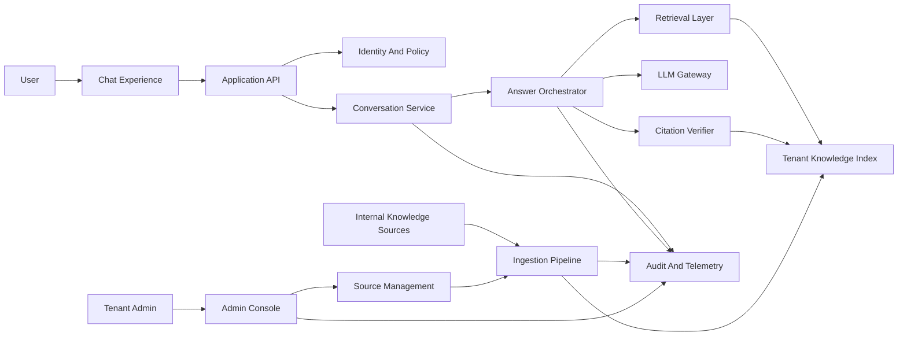
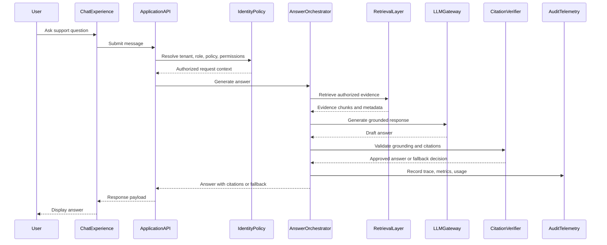

# Product Requirements: SupportLens AI

## 1. Handoff Block

### Context

SupportLens AI is a multi-tenant LLM-powered support copilot delivered as a chatbot. Its primary purpose is to help support users retrieve trusted internal knowledge faster by answering natural-language questions with citations to approved internal documentation.

### Key Findings

- Users need fast answers, but trust depends on visible citations and clear uncertainty handling.
- Tenant isolation and authorization are foundational requirements, not implementation details.
- The system should retrieve tenant-authorized evidence before generating substantive answers.
- Knowledge freshness, source health, and citation quality are as important as model quality.
- The first release should avoid autonomous customer-impacting actions and focus on grounded Q&A.

### Recommendations For HLD

- Treat ingestion, retrieval, answer orchestration, citation verification, policy enforcement, and telemetry as separate conceptual responsibilities.
- Keep the chat path independent from ingestion delays.
- Design every request around tenant context, policy resolution, authorization, and observability.
- Make citation behavior, fallback behavior, and retention policy explicit in frontend and backend design.

## 2. Problem Analysis

### Current State

Support users often search across internal documentation, runbooks, knowledge bases, and wiki pages manually. This is slow, inconsistent, and depends heavily on knowing where information lives and which sources are current.

### Pain Points

- Users spend too much time locating relevant internal knowledge.
- Search results often return documents rather than direct answers.
- Users must manually judge whether documentation is current, authoritative, and applicable.
- Support knowledge may be spread across multiple internal systems.
- AI answers without citations are hard to trust in support workflows.
- Multi-tenant environments create data leakage risk if access control is not designed into the product.

### Root Cause

Internal support knowledge is fragmented across sources, and traditional search does not synthesize answers or explain which evidence supports the result. LLMs can synthesize answers, but without retrieval, citations, authorization, and quality controls they introduce unacceptable trust and security risks.

### Desired Outcome

Support users can ask a question in natural language and receive a concise, citation-backed answer based only on tenant-authorized internal documentation. When evidence is missing, stale, conflicting, or unauthorized, the system clearly explains that it cannot provide a fully supported answer.

## 3. Scope

### In Scope For V1

- Chat-based question answering over tenant-approved internal documentation.
- Citation-backed answers with links or references to source documents or document sections.
- Tenant isolation across users, documents, conversations, policies, telemetry, and admin configuration.
- Role-based access for end users, support agents, tenant admins, content owners, platform operators, and compliance reviewers.
- Document-level authorization when source systems provide permissions or ACL metadata.
- Knowledge ingestion, normalization, chunking, indexing, refresh, and freshness tracking.
- Admin visibility into configured sources, ingestion status, failed syncs, stale content, and policy settings.
- User feedback on answer usefulness, correctness, missing citations, bad citations, and missing knowledge.
- Observability for chat latency, retrieval quality, model failures, citation failures, ingestion health, usage, and cost drivers.
- Audit events for security-relevant actions such as source changes, policy changes, admin configuration changes, retention changes, and access denials.

### Out Of Scope For V1

- Technology stack selection.
- Detailed frontend screen design.
- Detailed backend API contracts, schemas, or database design.
- Custom foundation model training.
- Public web search unless explicitly approved by tenant policy in a later release.
- Autonomous ticket resolution, refunds, account changes, data deletion, or other customer-impacting operations.
- Direct external customer access to the chatbot.
- Informal conversational sources such as chat history unless explicitly curated and approved as knowledge sources.

## 4. Users And Roles

- End User: Asks support questions and reviews citation-backed answers.
- Support Agent: Uses answers to troubleshoot customer issues faster and verify source material.
- Tenant Admin: Configures tenant policies, approved knowledge sources, retention, and access settings.
- Content Owner: Reviews stale, missing, failed, or low-quality content signals and improves source documentation.
- Platform Operator: Monitors reliability, usage, quality, ingestion health, security events, and cost.
- Security or Compliance Reviewer: Audits access decisions, tenant isolation, retention posture, deletion workflows, and admin activity.

## 5. V1 Product Decisions

- V1 audience: internal support users and support agents, not external end customers.
- V1 answer mode: retrieval-grounded Q&A over tenant-approved internal documentation.
- V1 citation rule: every substantive answer must cite source documents or source sections. If citations cannot be produced, the system must refuse, qualify the answer, or ask a clarifying question.
- V1 authorization model: tenant isolation is mandatory. Document-level authorization is mandatory when source permissions are available.
- V1 source policy: documentation-like sources such as product docs, runbooks, knowledge base articles, and internal wiki pages are preferred initial sources.
- V1 retention policy: prompts, answers, retrieved snippets, citations, traces, and feedback must follow tenant-configurable retention policies.
- V1 evidence policy: each substantive answer should retrieve fresh evidence, including follow-up turns. Conversation history may clarify intent but should not be the sole evidence source.

## 6. Functional Requirements

### Chat And Answering

- FR-1: Users must be able to ask natural-language support questions in a chatbot interface.
- FR-2: Users must be able to ask follow-up questions that reference earlier turns in the same conversation.
- FR-3: The system must retrieve relevant tenant-authorized documentation before generating a substantive answer.
- FR-4: The system must generate concise, support-oriented answers grounded in retrieved evidence.
- FR-5: Every substantive answer must include citations pointing to source documents or source sections used.
- FR-6: Users must be able to open citations and inspect original source context, subject to access control.
- FR-7: The system must distinguish between supported answers, partial answers, conflicting evidence, stale evidence, and unknown answers.
- FR-8: The system must refuse, qualify, or ask a follow-up question when evidence is missing, ambiguous, stale, conflicting, or below confidence thresholds.
- FR-9: The system must provide safe fallback behavior when the LLM, retrieval layer, policy layer, or source systems are unavailable.

### Tenant And Access Control

- FR-10: The system must resolve tenant context for every authenticated request.
- FR-11: The system must enforce tenant isolation across users, conversations, source configuration, documents, indexes, telemetry, audit logs, and usage data.
- FR-12: The system must enforce role-based access for user, support agent, tenant admin, content owner, operator, and compliance workflows.
- FR-13: The system must enforce document-level permissions where source systems expose ACLs or equivalent metadata.
- FR-14: The system must deny retrieval and citation display when user authorization cannot be confidently resolved.
- FR-15: Tenant admins must be able to configure allowed sources, answer policies, retention policies, and citation requirements.

### Knowledge Source Management

- FR-16: Tenant admins must be able to register, enable, disable, and inspect approved knowledge sources.
- FR-17: The system must ingest, normalize, chunk, index, and refresh documentation from approved sources.
- FR-18: The system must preserve source metadata, ownership, freshness state, version, citation anchor, and access metadata for indexed content.
- FR-19: Tenant admins and content owners must be able to view ingestion status, last successful sync, failed sync reason, and stale content indicators.
- FR-20: The system must support re-indexing after source changes, policy changes, permission changes, or ingestion failures.

### Feedback, Quality, And Operations

- FR-21: Users must be able to provide feedback on answer usefulness, incorrectness, missing citations, bad citations, and missing knowledge.
- FR-22: The system must capture answer quality signals for evaluation, troubleshooting, and content improvement.
- FR-23: Operators must be able to monitor ingestion health, answer latency, retrieval quality, model errors, citation failures, refusal rate, tenant usage, and cost drivers.
- FR-24: The system must record audit events for source changes, policy changes, admin configuration changes, retention changes, security-sensitive operations, and access denials.
- FR-25: Operators and authorized tenant admins must be able to inspect request traces at an appropriate redaction level.

## 7. Non-Functional Requirements

- NFR-1 Security: Tenant data must be isolated across storage, retrieval, generation, logs, metrics, traces, indexes, and administrative access.
- NFR-2 Privacy: Prompts, answers, retrieved snippets, feedback, and traces must follow tenant-configurable retention and data handling policies.
- NFR-3 Authorization: Retrieval must only use documents the requesting user is allowed to access.
- NFR-4 Citation Integrity: Citations must map to evidence actually retrieved and used for the answer.
- NFR-5 Groundedness: The system must prefer refusal or clarification over unsupported generation.
- NFR-6 Reliability: The chat path must degrade safely when dependencies fail and must not fabricate answers to hide failures.
- NFR-7 Availability: Chat and admin surfaces should be designed for high availability, while ingestion can tolerate delayed processing.
- NFR-8 Performance: Common support questions should return within an interactive response window, with streaming considered later to improve perceived latency.
- NFR-9 Scalability: The architecture must scale across tenants, users, documents, concurrent chats, ingestion jobs, and model calls without cross-tenant coupling.
- NFR-10 Freshness: Indexed content must expose last sync time, source version, failure reason, and stale status.
- NFR-11 Observability: Each answer must be traceable across request, tenant, policy decision, retrieval result, model call, citation check, response, feedback, and errors.
- NFR-12 Auditability: Admin and security-sensitive actions must produce durable audit records.
- NFR-13 Compliance: The system must support retention, deletion, export, and access review workflows.
- NFR-14 Quality: The system must support offline and online evaluation of retrieval relevance, citation correctness, groundedness, refusal behavior, and user satisfaction.
- NFR-15 Cost Control: Usage and cost drivers must be attributable by tenant, source, model call, ingestion volume, retrieval volume, and chat volume.
- NFR-16 Maintainability: Ingestion, retrieval, policy enforcement, answer orchestration, model access, admin workflows, and telemetry should have clear boundaries.
- NFR-17 Extensibility: New source connectors, answer policies, model providers, evaluation methods, and admin workflows should be addable without redesigning the entire service.

## 8. Product Workflows

### Ask A Question

1. A user opens the chatbot and asks a support question.
2. The system resolves tenant, user, role, policy, and source permissions.
3. The system retrieves relevant authorized evidence.
4. The system generates a grounded answer.
5. The system validates citations.
6. The user receives an answer, partial answer, clarification, refusal, or safe error.
7. The system records trace, usage, quality, and feedback hooks according to policy.

### Inspect Evidence

1. A user selects a citation.
2. The system verifies user authorization for the cited source.
3. The system displays citation metadata, source snippet, freshness information, and source link when allowed.
4. If authorization fails, the system hides source content and shows an access-safe message.

### Administer Knowledge Sources

1. A tenant admin registers or updates an approved knowledge source.
2. The system validates source configuration and policy.
3. The ingestion pipeline syncs source documents and metadata.
4. The admin can view sync status, document counts, failure reasons, stale content, and permission mapping state.

### Improve Content Quality

1. Users submit answer or citation feedback.
2. The system aggregates feedback with source, tenant, and answer metadata.
3. Content owners review stale, missing, failed, or low-quality content signals.
4. Content owners update the source documentation.
5. The system refreshes the index and reflects the updated source state.

### Operate The Platform

1. Operators monitor service health, latency, retrieval behavior, model failures, citation failures, ingestion backlog, source failures, usage, and cost.
2. Operators investigate request traces using tenant-aware redaction.
3. Operators use quality evaluations and feedback trends to identify regressions or content gaps.

## 9. Engineering Preview

### Conceptual Architecture

### Component Responsibilities

- Chat Experience: Accepts questions, displays answers, citations, feedback controls, fallback states, and conversation history.
- Application API: Provides the backend boundary for chat, citation, feedback, admin, policy, and operator workflows.
- Identity And Policy: Authenticates users, resolves tenant context, applies roles, and enforces source and document access policy.
- Conversation Service: Stores conversations, messages, answer records, citation references, feedback links, and retention lifecycle state.
- Answer Orchestrator: Coordinates retrieval, prompt construction, LLM invocation, citation validation, fallback behavior, response assembly, and usage metering.
- Retrieval Layer: Finds relevant authorized document chunks and returns evidence with source metadata and scores.
- Tenant Knowledge Index: Stores searchable representations of approved tenant documentation with access metadata, freshness metadata, and citation anchors.
- Ingestion Pipeline: Pulls approved source content, normalizes it, chunks it, attaches metadata, resolves permissions, records failures, and refreshes indexes.
- Source Management: Stores tenant source configuration, connector state, sync schedules, and source policies.
- LLM Gateway: Provides controlled model access, prompt policy, usage metering, retries, timeouts, and provider abstraction.
- Citation Verifier: Validates that answer citations are present, authorized, usable, and aligned with retrieved evidence.
- Audit And Telemetry: Captures traces, metrics, logs, feedback, admin actions, access decisions, usage, cost, and quality signals.

### High-Level Request Flow

### HLD Readiness

This PRD is ready for a dedicated HLD pass. The HLD should next define detailed frontend surfaces, backend API boundaries, data ownership, tenant isolation strategy, ingestion architecture, retrieval strategy, evaluation loops, deployment topology, and operational runbooks.

## 10. Success Criteria

- SC-1: Citation coverage: 100% of substantive answers include citations, or the response is classified as a refusal, clarification, partial answer, or safe error. Verify through answer trace sampling and automated response classification.
- SC-2: Tenant isolation: no cross-tenant data is returned in retrieval results, citations, conversations, admin views, telemetry views, or exports. Verify through isolation tests and access review.
- SC-3: Groundedness: sampled answers do not introduce material claims outside retrieved evidence. Verify through offline quality evaluation and human review.
- SC-4: Citation correctness: sampled citations support the answer claims they are attached to. Verify through citation evaluation and content owner review.
- SC-5: Source freshness visibility: tenant admins can see source sync status, last successful refresh time, failed sync reason, and stale content indicators. Verify through admin workflow testing.
- SC-6: Safe fallback: dependency failures produce safe errors, refusals, or partial answers instead of unsupported generated answers. Verify through fault injection and integration testing.
- SC-7: Operational traceability: operators can trace a chat answer across request, tenant, policy decision, retrieval result, model call, citation validation, response state, and feedback. Verify through observability review.

## 11. Constraints

- Technology choices are deferred until after PRD review.
- The v1 design must support multi-tenancy from the start.
- Retrieval, citation display, admin operations, telemetry, and exports must respect tenant and user authorization.
- Source systems may expose inconsistent metadata, freshness signals, or permission models.
- LLM outputs are probabilistic, so product behavior must rely on grounding, validation, refusal, and evaluation controls.
- Tenant retention and privacy policies may vary and must be configurable.

## 12. Risks And Mitigations

- Risk: Cross-tenant data leakage. Mitigation: enforce tenant scoping at every boundary, test isolation aggressively, and audit access decisions.
- Risk: Hallucinated or weakly grounded answers. Mitigation: require retrieval evidence, validate citations, set refusal thresholds, and evaluate groundedness continuously.
- Risk: Stale or incomplete documentation. Mitigation: expose freshness indicators, sync failures, source ownership, and content improvement feedback.
- Risk: Source permission mismatch. Mitigation: preserve ACLs where available and deny or exclude sources when permissions cannot be resolved.
- Risk: Low user trust. Mitigation: make citations prominent, explain uncertainty, collect feedback, and prioritize correctness over confident but unsupported answers.
- Risk: High latency. Mitigation: separate ingestion from chat serving, monitor latency by stage, and consider streaming in frontend/backend HLD.
- Risk: Cost growth. Mitigation: meter usage by tenant, track model and ingestion cost drivers, and expose quotas or budget controls.
- Risk: Operational opacity. Mitigation: require traceability from question to retrieval, generation, citation validation, answer, and feedback.

## 13. Open Questions For Review

- [PM] Which source types are mandatory for v1: wiki, runbooks, product docs, knowledge base articles, ticket history, or curated FAQs?
- [PM] What is the minimum acceptable retention period for prompts, answers, retrieved snippets, traces, and feedback?
- [Architect] Should sources without document-level ACLs be allowed as tenant-shared sources, or excluded from v1?
- [Architect] What latency target should define an interactive answer window for v1?
- [EM] What initial tenant scale, document volume, and concurrent usage should the HLD design for?
- [Engineer] What quality evaluation set should be created before launch to test groundedness, citation correctness, and refusal behavior?

## 14. Acceptance Checklist

- Functional requirements cover chat, retrieval, citations, tenant isolation, source management, feedback, and operations.
- Non-functional requirements cover security, privacy, authorization, reliability, performance, scalability, freshness, observability, auditability, compliance, quality, cost, and maintainability.
- V1 scope is explicit and avoids unsupported customer-impacting automation.
- Success criteria are measurable and include verification methods.
- Engineering preview identifies the conceptual components needed for the HLD.
- Open questions are role-tagged for review.
