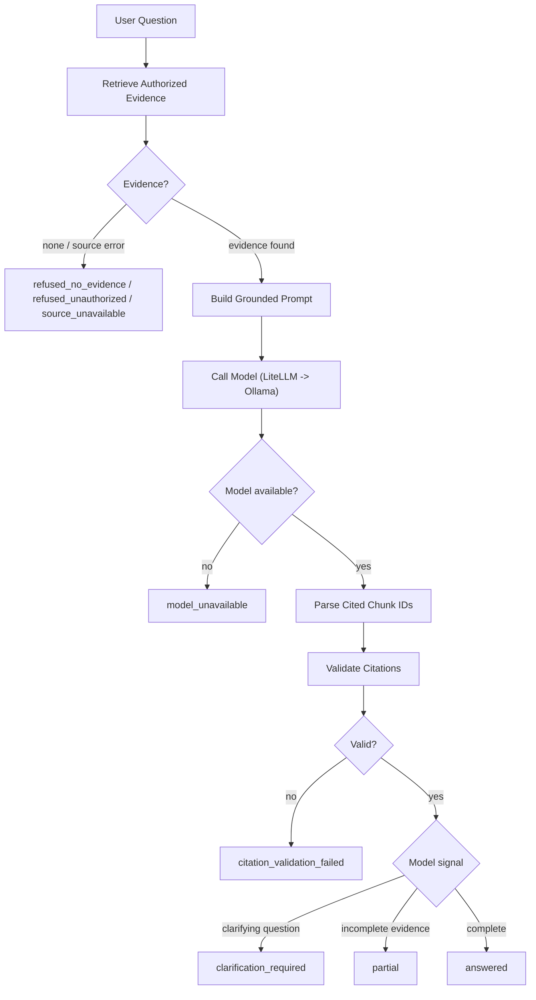

# LLM Integration And Answer Quality

SupportLens AI answers support questions only from retrieved, tenant-authorized evidence. This layer owns the second half of the answer path: once retrieval returns evidence, the answer orchestrator assembles a grounded prompt, calls a language model through the LLM gateway, parses and validates the citations the model used, classifies the result into a safe answer state, and persists the answer with its trace. Orchestration lives in `apps/api/app/modules/answer`, model access in `apps/api/app/modules/llm_gateway`, and citation validation in `apps/api/app/modules/citation`. Embeddings share the same gateway package but belong to the Retrieval And Ingestion component.

## Responsibilities

- Assemble a grounded prompt from the question, conversation context, and retrieved evidence, with each chunk anchored so the model can cite it and the orchestrator can parse those citations back out.
- Call a local LLM through the LiteLLM proxy (OpenAI-compatible) routed to Ollama, with a timeout, bounded retries with backoff, and a deterministic offline fallback.
- Parse the chunk IDs the model cited and validate them: present, drawn from retrieved evidence, supported by the answer text, and resolvable to a real evidence span.
- Classify every result into exactly one answer state and produce a short, safe user-facing message for each.
- Never fabricate an answer to hide a dependency failure: missing evidence, model failure, or failed citation validation all resolve to safe terminal states.
- Emit a trace stage for retrieval, model call, and citation validation, and meter usage, so operators can reconstruct how each answer was produced.

The chat path enters this layer through `generate_answer` in [apps/api/app/modules/answer/service.py](../../apps/api/app/modules/answer/service.py), which is the orchestrator for the entire flow.

## Answer Flow

The orchestrator treats each decision as a fail-safe gate: it only reaches the next stage when the prior stage produced something it can stand behind, and any gate can short-circuit into a safe terminal state.

## LLM Gateway

Model access is centralized in [apps/api/app/modules/llm_gateway/service.py](../../apps/api/app/modules/llm_gateway/service.py) so prompt policy, retries, timeouts, and provider abstraction live in one place. The gateway exposes a single `call_model(prompt_bundle, model_options)` entry point that returns a `ModelResult` carrying the generated text, the model name, an `unavailable` flag, and call metadata (latency, attempts) for the trace.

### LiteLLM Proxy To Ollama

The production path calls the LiteLLM proxy using an OpenAI-compatible chat completion request over the already-present `httpx` dependency. LiteLLM routes the request to a local Ollama model (see [infra/litellm.yaml](../../infra/litellm.yaml), default `ollama/llama3.1:8b`). Keeping the API behind LiteLLM rather than calling Ollama directly means switching or adding model providers later is a config change, not a code change, and gives one place to add usage and retry hooks.

| Option | Pros | Cons | Decision |
|---|---|---|---|
| LiteLLM proxy with Ollama backend | Free local/self-hosted path, OpenAI-compatible API, easy provider/model switching later, one place for retry and usage hooks | One extra local process and config file | Selected for the free MVP |
| Ollama direct API | Free local runtime, simple HTTP integration, no proxy process | Harder to switch providers/models cleanly later | Not selected |
| Direct hosted provider SDKs | Minimal dependencies, full control | Paid usage and vendor-specific code | Not selected for the free MVP |
| LiteLLM library in-process | Provider abstraction without a separate proxy | Couples provider config to API deployment | Acceptable alternative |

### Timeout, Retry, And Model-Unavailable Handling

The gateway wraps each LiteLLM call with:

- A request **timeout** (`llm_timeout_seconds`) so a slow or hung model never blocks the chat path indefinitely.
- Bounded **retries with backoff** (`llm_max_retries`, `llm_retry_backoff_seconds`) on transient failures (timeouts, connection errors, 5xx) within the latency budget. Non-transient failures are not retried.
- A typed `ModelCallError` raised when generation cannot complete after retries.

When the call cannot complete, the gateway degrades rather than failing hard: if evidence is present it falls back to the deterministic local generator; only when that fallback is also unavailable does it return `ModelResult(unavailable=True)`, which the orchestrator records as `model_unavailable`.

### Deterministic Offline Fallback

`local_deterministic_llm` selects a deterministic, dependency-free generator that produces an answer from the leading evidence chunk. It mirrors the embedding gateway's hash-fallback pattern: it keeps the offline test suite and lightweight installs working without a live Ollama, and it keeps existing chat tests reproducible. The flag defaults to `True`, so local development, tests, and the default Docker Compose stack all use the deterministic generator. To run the real LiteLLM path, set `SUPPORTLENS_LOCAL_DETERMINISTIC_LLM=false` (in Docker Compose this means adding it to the `api` service environment, since Compose wires up the LiteLLM and Ollama services but leaves the flag at its default). A `simulate_model_unavailable` hook in the question text forces the unavailable path so the `model_unavailable` state stays testable offline.

## Prompt Templates

The grounded prompt is built in [apps/api/app/modules/answer/prompts.py](../../apps/api/app/modules/answer/prompts.py). It instructs the model to:

- Answer only from the supplied evidence and cite the chunks it used by their anchor.
- Refuse when the evidence does not contain the answer.
- Ask a clarifying question when the request is ambiguous.
- Give a partial answer, clearly flagged, when the evidence only partially covers the question.
- Flag conflicting evidence rather than silently picking one side.

The evidence is rendered as an anchored block (chunk ID plus citation anchor plus text) so the model can reference specific chunks and the orchestrator can parse the cited IDs back out for validation. Conversation history may clarify intent but is explicitly not allowed to be the sole evidence source, consistent with the v1 evidence policy.

## Citation Validation

Validation lives in [apps/api/app/modules/citation/service.py](../../apps/api/app/modules/citation/service.py) and goes beyond checking that a chunk ID exists. The orchestrator parses the chunk IDs the model cited from the answer text and runs each through these checks:

- **Presence** — at least one citation is provided.
- **Provenance** — every cited chunk ID comes from the retrieved evidence set, not an arbitrary or hallucinated ID.
- **Claim support** — each cited chunk shares meaningful token overlap with the answer text, so a citation cannot be attached to a claim the chunk does not support. This check is lexical and deterministic so it runs offline and in tests.
- **Span resolution** — the cited anchor resolves to a real evidence chunk with a non-empty snippet span.

`CitationValidationResult` carries a structured reason for the first failed check, which is written to the citation-validation trace stage. When validation fails, the orchestrator returns a safe refusal instead of surfacing uncited or weakly grounded model text.

## Answer States

`classify_answer_state` and `generate_answer` resolve every request into one of the states defined in [apps/api/app/modules/answer/schemas.py](../../apps/api/app/modules/answer/schemas.py):

| State | When | User-facing behavior |
|---|---|---|
| `answered` | Evidence found, model answered, citations valid | Answer text with validated citations |
| `partial` | Evidence only partially covers the question | Partial answer, flagged, with citations |
| `clarification_required` | Question is ambiguous | A clarifying follow-up question, no claim |
| `refused_no_evidence` | No indexed evidence clears the threshold | Safe refusal, no citations |
| `refused_unauthorized` | Evidence existed but ACL filtering removed all of it | Access-safe refusal, no citations |
| `source_unavailable` | Retrieval/index raised an error | Safe error, no fabricated answer |
| `model_unavailable` | LiteLLM and fallback both failed | Safe error, no fabricated answer |
| `citation_validation_failed` | Citations missing, unsupported, or unresolvable | Safe refusal instead of uncited text |

`refused_unauthorized` is distinguished from `refused_no_evidence` so traces show whether nothing was indexed versus whether authorization removed the only matches; `source_unavailable` is distinguished from both so a retrieval/index error is never reported as a content refusal.

## Launch Evaluation Dataset

A small launch evaluation dataset of representative support questions lives under `apps/api/app/modules/evaluation/datasets`. Each scenario is tagged with its expected answer state (for example `answered`, `refused_no_evidence`, `clarification_required`, `partial`) so the quality evaluation in [apps/api/app/modules/evaluation/service.py](../../apps/api/app/modules/evaluation/service.py) and the launch gate run against real scenarios rather than static placeholder scores. This gives groundedness, citation correctness, retrieval relevance, and refusal correctness something concrete to measure before launch.

## Logging And Redaction

Modules in this layer use the standard library `logging` with a module-level logger. The gateway logs model selection, latency, attempt counts, and fallback decisions at `INFO`, and logs LiteLLM failures at `ERROR` with the proxy/runtime status. Consistent with the LLD redaction posture, log sites emit identifiers and metadata (tenant id, trace id, model name, latency, citation validation result) rather than raw prompts, source text, or generated answers unless tenant policy permits it. Answer traces store redacted stage metadata, not raw content.

## Testing

The offline-safe deterministic generator means the chat and answer tests run without a live Ollama. Tests are split into `apps/api/tests/unit` and `apps/api/tests/integration`. `integration/test_chat_retrieval_answer.py` covers the seeded answered path, no-evidence refusal, the simulated model-unavailable path, and paraphrased retrieval. `unit/test_llm_answer_quality.py` exercises every answer state (`answered`, `partial`, `clarification_required`, `refused_no_evidence`, `refused_unauthorized`, `source_unavailable`, `model_unavailable`, `citation_validation_failed`), the citation claim-support and span-resolution failure cases, the LiteLLM path with a monkeypatched HTTP client to assert timeout, retry, and fallback behavior, and the launch dataset loader. The API coverage gate is `pytest --cov=app --cov-report=term-missing --cov-fail-under=80`.

For a full live check of real generation, the opt-in `integration/test_e2e_live_answer.py` runs the entire path against a real LiteLLM/Ollama model and real `sentence-transformers` embeddings; it auto-skips unless those services and the `embeddings` extra are present (see the README's live e2e instructions).

## Known Limits And Future Work

- Claim support is a lexical token-overlap check chosen for determinism and offline safety. A model-based or semantic groundedness grader is a future extension and is intentionally out of scope for v1.
- The deterministic fallback is not semantically meaningful; production should run the real LiteLLM proxy to Ollama (`local_deterministic_llm=false`) so answers come from a real model.
- v1 uses bounded retries with fixed backoff and a single model route. Multi-provider routing, fallback model chains, and streaming responses are future LiteLLM/gateway extensions.
- Evaluation runs on a small curated launch set; expanding scenarios and wiring quality gates into CI/CD is future Quality And Scale work.
