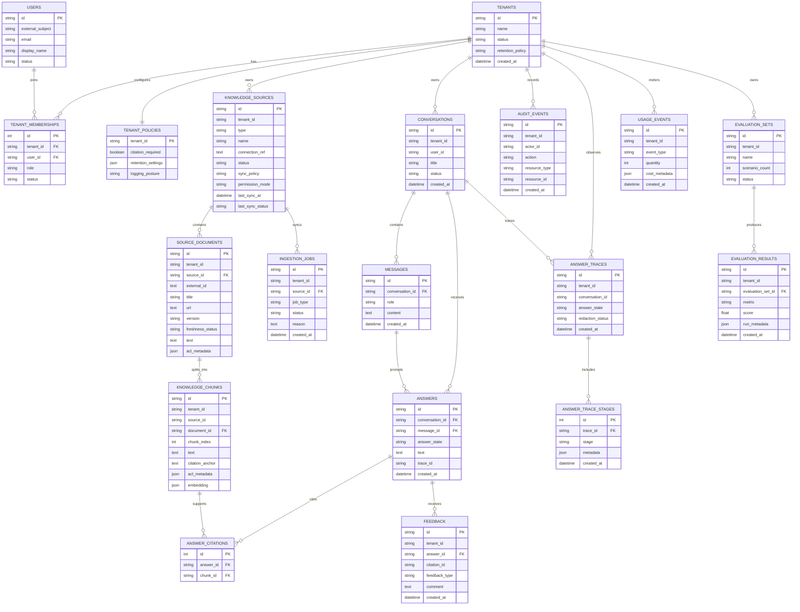

# Persistence And Data Layer

SupportLens AI uses PostgreSQL as the normal local and development datastore. The API maps durable records with SQLAlchemy models in `apps/api/app/db/models.py`, and Alembic migrations under `apps/api/alembic` own schema creation and upgrades. The persistence layer is intentionally centralized in the API app for the MVP: route handlers call domain services, services read and write SQLAlchemy rows, and Pydantic/dataclass objects remain the API response boundary.

## Responsibilities

The data layer owns four concerns:

- Durable records for tenant metadata, sources, documents, chunks, ingestion jobs, conversations, messages, answers, answer citations, feedback, audit events, answer traces, usage events, evaluation sets, and evaluation results.
- Schema evolution through Alembic migrations, with `apps/api/app/db/schema.sql` treated as the initial schema source and migration history as the managed runtime source of truth.
- Request-scoped transaction handling so multi-step flows either commit together or roll back together.
- Local development ergonomics through Docker Compose, Postgres defaults, and a migration command that is the same inside and outside the API container.

Current retrieval still reads chunk rows into the existing lexical/token-counter ranking code. PostgreSQL full-text, trigram, and pgvector ranking are tracked separately in `docs/TODO.md` because they change retrieval behavior, not just persistence.

## Technology Choices And Tradeoffs

### PostgreSQL With pgvector

PostgreSQL is the primary datastore because it can store application metadata, normalized source text, audit data, and v1 retrieval indexes in one free local service. The `pgvector` extension keeps the future semantic search path close to the existing relational data, while `pg_trgm` and full-text search provide a natural path for stronger lexical retrieval.

| Option | Pros | Cons | Decision |
|---|---|---|---|
| PostgreSQL with `pgvector`, `pg_trgm`, and full-text search | One local service for relational data, source text, audit records, lexical search, and future vector search. Free, mature, easy to run in Docker Compose. Keeps tenant filters and retrieval filters close to the data. | Postgres carries more responsibility than a pure metadata store. Vector or lexical ranking may need a dedicated search system later if data volume or latency requirements grow. | Selected for MVP because it minimizes infrastructure while supporting the planned retrieval path. |
| PostgreSQL without `pgvector` | Simplest relational option. Good fit for conversations, feedback, traces, usage, sources, and evaluation records. | Does not support semantic retrieval without adding another vector store. Would force an earlier split for embeddings. | Rejected because SupportLens is a RAG app and needs a clear semantic search path. |
| PostgreSQL plus OpenSearch | Stronger lexical search, analyzers, highlighting, and search observability. Can scale search separately from relational writes. | Adds another service, sync pipeline, consistency concerns, and operational cost. More complex for local-first MVP. | Deferred until Postgres lexical search is insufficient. |
| PostgreSQL plus Qdrant or Weaviate | Dedicated vector search with stronger ANN indexing and vector-specific operations. Can scale embedding retrieval independently. | Adds a second datastore and requires keeping tenant/source/chunk metadata synchronized. More moving parts for local setup. | Deferred until `pgvector` becomes a bottleneck. |
| Managed vector database | Fast to scale and usually simple to query. Reduces self-hosting work. | Paid service, vendor dependency, network dependency, and more data handling review for source text/embeddings. | Not selected for the free local MVP. |
| SQLite | Very easy local setup and fast tests. No external service required. | Does not match production-like Postgres behavior, lacks `pgvector`/`pg_trgm`, and hides migration/index issues. | Used only as an isolated test convenience, not as the normal local/dev path. |

### SQLAlchemy 2.0 ORM

SQLAlchemy provides explicit, mature database mapping without forcing the API schemas to become database models. That separation matters here: route responses are Pydantic models and dataclasses shaped around API behavior, while SQLAlchemy rows are shaped around persistence, indexes, foreign keys, and migration stability.

| Option | Pros | Cons | Decision |
|---|---|---|---|
| SQLAlchemy 2.0 ORM | Mature, explicit, widely used with FastAPI, works cleanly with Alembic, and keeps persistence models separate from API schemas. Supports both simple CRUD and more advanced queries later. | Requires row-to-schema mapping code. Developers must manage sessions and avoid accidental lazy-loading patterns. | Selected because it fits the existing explicit service-module style. |
| SQLModel | Combines Pydantic and SQLAlchemy concepts, reducing duplicated model declarations for simple APIs. Ergonomic for CRUD-heavy apps. | Can blur API schema and persistence schema boundaries. Less flexible when database rows and response contracts need to diverge. | Not selected because SupportLens already has response schemas/dataclasses and domain services. |
| Raw psycopg SQL | Maximum SQL control, no ORM abstraction, and no hidden lazy-loading behavior. Can be very clear for query-heavy code. | More boilerplate for inserts, updates, mapping, transactions, and test setup. Harder to keep CRUD-heavy modules consistent. | Not selected for the broad persistence replacement because it would add repetitive mapping code. |
| Django ORM | Batteries-included ORM with migrations and admin patterns. Productive for standard web apps. | Would introduce Django conventions into a FastAPI codebase and reshape the app architecture. | Not selected because the backend is already FastAPI with explicit domain modules. |
| Prisma or another external ORM | Strong generated clients and schema-driven workflows in some stacks. | Weaker fit for Python FastAPI and current repo conventions. Adds tooling outside the Python ecosystem used by the API. | Not selected. |

### Alembic Migrations

Alembic is used because schema changes need to be repeatable in local Docker, developer machines, and later CI. The API container runs `alembic upgrade head` before Uvicorn starts, and direct local development should run the same command from `apps/api`.

| Option | Pros | Cons | Decision |
|---|---|---|---|
| Alembic | Standard SQLAlchemy migration tool. Supports explicit migrations, autogeneration, offline SQL, and repeatable local/CI setup. | Migration files must be maintained carefully when models change. Autogeneration still needs review. | Selected as the managed schema boundary. |
| Plain `schema.sql` applied directly | Simple to read and easy for a first scaffold. No migration framework needed. | Poor history, difficult incremental upgrades, and risky for existing databases. Does not encode evolution over time. | Replaced by Alembic migrations, with `schema.sql` retained as the starter reference. |
| SQLAlchemy `create_all` only | Very convenient for tests and throwaway local databases. | Not a real migration strategy. Cannot safely upgrade existing schemas or track production changes. | Used only for fast test database setup, not runtime schema management. |
| Flyway or Liquibase | Strong migration tools, language-agnostic, common in larger platform teams. | Adds JVM-oriented or external tooling to a Python service. Less integrated with SQLAlchemy metadata. | Not selected for this Python-first MVP. |
| Django migrations | Mature and productive when using Django ORM. | Tied to Django’s app/model system, not a fit for this FastAPI/SQLAlchemy codebase. | Not selected. |

### JSON Columns For Flexible Metadata

ACL metadata, trace stage metadata, cost metadata, evaluation run metadata, and retention settings are stored as JSON. These fields are intentionally flexible because the exact source connector metadata, tracing shape, and evaluation diagnostics will evolve as ingestion and answer quality features mature.

| Option | Pros | Cons | Decision |
|---|---|---|---|
| PostgreSQL JSON/JSONB metadata columns | Flexible shape for connector ACL metadata, trace stages, cost metadata, and evaluation diagnostics. Avoids premature schema churn while those shapes evolve. | Weaker database-level validation. Query performance depends on indexes added later for known access patterns. | Selected for metadata whose shape is expected to change. |
| Fully normalized metadata tables | Stronger constraints, clearer relationships, and easier targeted indexing once access patterns are known. | More tables and migrations up front. Can overfit unstable metadata shapes early. | Deferred until specific metadata fields become stable and heavily queried. |
| Text blobs containing serialized JSON | Very simple and portable. | Harder to validate and query. Loses PostgreSQL JSON operators and indexing options. | Rejected because JSONB gives better query/index options with little extra complexity. |
| External document store | Flexible documents and potentially better document-style querying. | Adds another datastore and consistency boundary for data that is already tied to relational records. | Not selected for MVP. |

### Request-Scoped Sessions

Each API request opens one SQLAlchemy session through middleware in `apps/api/app/main.py`. The session commits when the request completes successfully, rolls back when an exception escapes, and always closes at the end of the request. Service modules retrieve the bound session from `apps/api/app/db/session.py`, which keeps route signatures small while preserving transaction boundaries.

| Option | Pros | Cons | Decision |
|---|---|---|---|
| Request-scoped session middleware | One transaction wraps the whole request. Multi-step flows commit or roll back together. Route signatures stay small. | Service functions assume a bound session exists. Long-running requests can hold a transaction longer than ideal. | Selected for current synchronous API flows. |
| FastAPI dependency-injected sessions per route | Explicit dependency graph and common FastAPI pattern. Easy to override in tests. | Sync dependencies and sync endpoints can run in different execution contexts. Passing sessions through every service call creates signature churn. | Not selected after implementation because middleware provided cleaner transaction propagation. |
| Explicit session parameter in every service function | Very clear dependencies and easy worker reuse. No hidden context. | Large signature changes across modules and routes. More boilerplate in current service layer. | Deferred unless workers or service reuse need stricter explicitness. |
| Session per service operation | Short transactions and simple local reasoning for single writes. | Multi-step flows can partially commit, making rollback behavior weaker for chat generation and sync workflows. | Rejected because SupportLens needs request-level atomicity. |
| Async SQLAlchemy sessions | Better fit if the API becomes fully async with async DB drivers. | More complexity now; current services are synchronous and CPU/local-IO oriented. | Deferred until async DB access is needed. |

## Data Model Shape

The durable schema is organized around five domains: tenant/auth metadata, knowledge sources and chunks, conversations and answers, operator telemetry, and evaluation results. Most tenant-scoped tables carry a `tenant_id` column so every service query can fail closed by tenant. Some of those tenant columns are logical ownership fields rather than database foreign keys today; the service layer still treats tenant filtering as mandatory for protected data access.



### Tenant And Policy Models

`tenants`, `users`, `tenant_memberships`, and `tenant_policies` describe who is using the system and what tenant-level defaults apply. Memberships connect users to tenants and roles, while policies hold behavior such as citation requirements, retention settings, and logging posture. The current MVP still resolves request context from headers, but these tables give the production auth boundary a durable target.

### Source And Retrieval Models

`knowledge_sources` stores source configuration, sync policy, permission mode, and last sync status. `source_documents` stores normalized source documents for a source, including freshness and ACL metadata. `knowledge_chunks` stores chunk-level text, citation anchors, ACL metadata, and an embedding placeholder. Retrieval reads chunks because chunks are the evidence unit shown in answer citations.

`ingestion_jobs` records sync attempts for a source. Jobs are separate from sources so operators can inspect a history of initial syncs, manual resyncs, retries, permission refreshes, and cleanup operations. Source sync replaces documents and chunks in a nested transaction so a failed replacement can keep the last-known-good index intact.

### Conversation And Answer Models

`conversations` is the user-facing chat container. `messages` stores user and assistant message content within a conversation. `answers` stores the generated answer for a message, including the answer state and trace identifier. `answer_citations` is a join table between answers and chunks, which lets one answer cite multiple evidence chunks without storing citation IDs as an opaque list. `feedback` attaches user feedback to an answer and optionally to a specific citation.

### Telemetry Models

`audit_events` records durable operator/audit history for security-sensitive actions such as source creation, updates, deletes, and syncs. `answer_traces` records answer workflow status at the trace level, while `answer_trace_stages` stores the ordered stage metadata for policy checks, retrieval, model calls, and citation validation. `usage_events` stores metering records such as conversation creation, message writes, answers, feedback, and retrieved chunk counts.

### Evaluation Models

`evaluation_sets` describes a group of scenarios or checks. `evaluation_results` stores per-metric scores and run metadata for an evaluation set. Keeping sets and results separate lets the system preserve historical runs and add more metrics without changing the set definition.

### Relationship Design Notes

The model keeps source documents and chunks separate so sync jobs can replace a source index cleanly while retrieval can read chunk-level evidence. Answers and citations are separate because citation cardinality is many-to-many: an answer can cite multiple chunks, and a chunk can support many answers over time. Trace stages are separate from traces because the answer workflow appends structured stage records as the workflow progresses. Evaluation results are separate from evaluation sets so repeated runs can accumulate over time.

## Transactions And Rollback Behavior

Most request flows are single transaction units. For example, chat answer generation can create a conversation, add a user message, create a trace, retrieve evidence, call the model, validate citations, store the answer, and record usage. If an unhandled failure occurs midway, the transaction rolls back and partial conversation or trace rows are not committed.

Source sync has one additional safeguard: document and chunk replacement runs in a nested transaction. If replacement fails after deleting old chunks but before inserting the new index, the savepoint rolls back that replacement and preserves the last-known-good rows. The outer request can still record the failed job status and source failure reason.

## Local Development Flow

For Docker Compose, the API service points `SUPPORTLENS_DATABASE_URL` at the Postgres service and waits for the Postgres health check. The API image includes `alembic.ini` and `apps/api/alembic`, then runs migrations before starting Uvicorn.

For direct API development:

```bash
cd apps/api
python -m venv .venv
source .venv/bin/activate
pip install -e '.[test]'
alembic upgrade head
uvicorn app.main:app --reload --host 127.0.0.1 --port 8000
```

Tests use an isolated SQLite database for fast integration coverage of service behavior and rollback semantics. PostgreSQL-specific behavior is verified by applying Alembic migrations against the local `pgvector/pgvector:pg16` container.

## Known Limits And Future Work

This layer persists chunks and has the extensions required for stronger retrieval, but it does not yet implement PostgreSQL full-text search, trigram ranking, real embeddings, or pgvector similarity search. Those belong to the Retrieval And Ingestion work because they change ranking behavior and require embedding generation/versioning.

The current schema stores normalized source text directly in PostgreSQL. That is appropriate for the MVP scale and keeps local development simple, but large binary files, long retention windows, or compliance-driven raw document retention may justify object storage later.

CI migration wiring is still intentionally separate from this component note. When CI is added, it should start a Postgres/pgvector service, run `alembic upgrade head`, and then execute the API tests against a database URL controlled by the pipeline.
