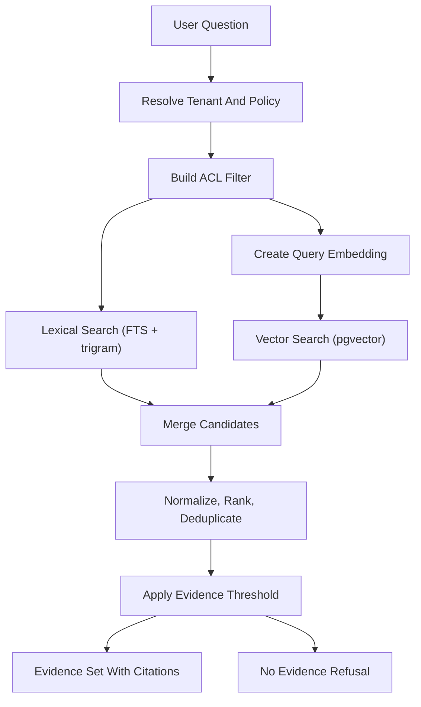

# Retrieval And Ingestion

SupportLens AI turns approved tenant documentation into citation-backed answers. This layer owns two halves of that path: ingestion pulls source content, normalizes it, chunks it, embeds it, and indexes it; retrieval finds the most relevant authorized chunks for a question and returns them as evidence. Retrieval code lives in `apps/api/app/modules/retrieval`, embeddings in `apps/api/app/modules/llm_gateway/embeddings.py`, source configuration and sync in `apps/api/app/modules/source_management`, and the background workers in `workers/ingestion` and `workers/scheduler`.

## Responsibilities

- Normalize, chunk, embed, and index approved source documents into `source_documents` and `knowledge_chunks`.
- Track embedding provenance (`embedding_model`, `embedding_version`) on every chunk so embeddings can be refreshed when the model changes.
- Run hybrid retrieval (full-text + trigram + vector) scoped by tenant and document ACLs, then merge, rank, threshold, and either return evidence or signal a refusal.
- Execute sync work either inline (local/test) or on Redis/RQ workers (Docker Compose), with retry, scheduled refresh, incremental update, permission refresh, re-embedding, and cleanup job types.
- Preserve the last-known-good index when a sync fails, so retrieval keeps working on the previously indexed content.

The chat path consumes this layer through `retrieve_evidence` in [apps/api/app/modules/retrieval/service.py](../../apps/api/app/modules/retrieval/service.py); ingestion is driven from the source admin APIs in `apps/api/app/modules/source_management/routes.py`.

## Hybrid Retrieval

Retrieval combines three signals so it can match both exact strings (error codes) and paraphrased questions:

- **Full-text search** ranks lexical relevance using PostgreSQL `tsvector`/`ts_rank`.
- **Trigram search** (`pg_trgm`) catches fuzzy and near-exact matches that full-text misses.
- **Vector search** (`pgvector` cosine distance) captures semantic similarity from embeddings.

Lexical and vector each contribute up to 50 candidates. `merge_and_rank` in [apps/api/app/modules/retrieval/ranking.py](../../apps/api/app/modules/retrieval/ranking.py) min-max normalizes each list independently before combining, because `ts_rank` and cosine scores live on different scales and one would otherwise dominate the other purely by units. A chunk found by both signals sums its normalized scores, so agreement ranks it above single-signal matches. After dedupe, the top match must clear `min_score` or retrieval reports `threshold_met=False`, which the answer orchestrator treats as a refusal rather than asking the model to fill gaps.

### Dialect-Aware Behavior

Postgres full-text, trigram, and `pgvector` only exist on PostgreSQL, but the test suite must also run without a database server. Retrieval therefore branches on the bound session's dialect:

| Dialect | Lexical | Vector |
|---|---|---|
| PostgreSQL | `ts_rank` + `pg_trgm` similarity via SQL, tenant + ACL filtered | `embedding_vector <=> query` cosine via SQL |
| SQLite (fallback) | In-Python token overlap | In-Python cosine over the JSON `embedding` column |

The Postgres path is the production behavior; the SQLite path keeps the existing in-memory tests fast and dependency-free. Both paths apply tenant and ACL source filters before scoring, so unauthorized chunks never rank.

## Embeddings

Embeddings are produced by an embedding gateway in [apps/api/app/modules/llm_gateway/embeddings.py](../../apps/api/app/modules/llm_gateway/embeddings.py).

- The default model is `sentence-transformers/all-MiniLM-L6-v2` (384 dimensions). The model is loaded lazily and cached.
- `sentence-transformers` (and torch) are heavy and **optional** (`pip install -e '.[embeddings]'`). When the package is unavailable, or a model fails to load or encode, the gateway logs the issue and falls back to a deterministic hash-based embedder that produces a stable 384-dim vector. This keeps tests reproducible and lets the vector search path exercise real cosine math offline.
- Every chunk records `embedding_model` and `embedding_version`. On PostgreSQL the JSON `embedding` is mirrored into the native `embedding_vector` (`vector(384)`) column that the similarity index uses.

### Re-Embedding Workflow

When the embedding strategy changes, bump `EMBEDDING_VERSION` (or swap the model). The `reembed` job type (`POST /v1/admin/sources/{id}/reembed`) re-embeds only the chunks whose stored `embedding_model`/`embedding_version` differs from the current embedder, without re-fetching source documents. This makes model upgrades incremental and cheap.

## Ingestion Execution

A sync is recorded as an `ingestion_jobs` row and executed by `run_sync_job`. Execution mode is controlled by the `ingestion_async_enabled` setting:

- **Off (default, local/test):** the job runs inline in the request and the API returns the finished job. This matches the synchronous test suite.
- **On (Docker Compose):** the job is enqueued on Redis/RQ and a worker runs it; the API returns the still-queued job so the chat path never blocks on ingestion. If Redis is unreachable, the system logs the failure and falls back to inline execution rather than dropping the job.

The RQ worker entrypoint is `workers/ingestion/main.py`; the job handler `workers/ingestion/jobs.py` opens its own database session scope and rebuilds a tenant-scoped request context before calling `run_sync_job`.

### Job Types

| Job | Trigger | Purpose |
|---|---|---|
| `initial_sync` | source create/enable | First ingest |
| `scheduled_refresh` | scheduler | Periodic refresh of auto-sync sources |
| `incremental_update` | source delta | Apply changed content |
| `manual_resync` | admin | Force refresh |
| `retry_failed_sync` | retry policy | Retry transient failures |
| `permission_refresh` | schedule/admin | Re-apply ACL metadata to docs and chunks |
| `reembed` | model/version change | Refresh stale embeddings only |
| `cleanup_source` | disable/delete | Remove indexed chunks |

`enqueue_scheduled_refreshes` in `workers/scheduler/sync_scheduler.py` scans enabled sources whose `sync_policy` is automatic and enqueues a `scheduled_refresh` per source. RQ retry with a fixed backoff (`ingestion_max_retries`, `ingestion_retry_backoff_seconds`) covers transient worker failures.

### Last-Known-Good Index

Document and chunk replacement runs inside a savepoint (`begin_nested`). If replacement fails midway, the savepoint rolls back and the previously indexed chunks remain intact; the outer transaction still records the failed job status and failure reason. This behavior is verified on both SQLite and Postgres-backed data.

## Connectors

Source loading is connector-based, with a registry in [apps/api/app/modules/source_management/connectors.py](../../apps/api/app/modules/source_management/connectors.py) mapping `source.type` to a loader. v1 ships:

- `inline` — text stored directly in the source configuration.
- `filesystem` / `markdown` — read `.md` files from a path or directory.
- `http` / `url` — fetch a URL and strip HTML down to readable text.

New connectors register via `register_connector(source_type, loader)` without touching ingestion logic. Workers reuse the same registry so loading behaves identically inline or on a worker.

## Logging And Redaction

All modules in this layer use the standard library `logging` with a module-level logger. Progress milestones log at `INFO` (retrieval start/finish with candidate counts and the dialect path, embedding model load and batch sizes, sync start/complete with document and chunk counts, re-embedding counts, job enqueue, scheduled refresh counts, connector fetch counts). Failures log at `ERROR` with a stack trace and keep the fail-safe behavior (last-known-good index, safe refusals). Log sites emit identifiers and counts (tenant id, source id, job id, chunk counts, dialect) rather than raw prompts, source text, or answers, consistent with the logging and redaction posture in the LLD.

## Testing

The test harness in `apps/api/tests/conftest.py` starts a `pgvector/pgvector:pg16` testcontainer and runs Alembic migrations against it when Docker is available, exercising the real FTS/trigram/pgvector path; otherwise it falls back to SQLite in-memory. Postgres-only tests (`test_retrieval_postgres.py`) skip on the SQLite fallback. Worker coverage (`test_ingestion_workers.py`, `test_connectors_and_queue.py`) covers cleanup, permission refresh, incremental update, re-embedding, retry then success with last-known-good preservation, the worker entrypoint, scheduled refresh enqueue, the connector registry, and the async enqueue path using fakeredis.

## Known Limits And Future Work

- `pgvector` with an IVFFlat index is adequate for the v1 scale (about 10,000 pages). A dedicated vector database (Qdrant, Weaviate, Milvus) is the future split point when vector search becomes a bottleneck.
- PostgreSQL full-text and trigram cover v1 lexical needs; OpenSearch is the future option if ranking and filtering outgrow Postgres.
- Normalized source text is stored in PostgreSQL; object storage is a future option for large or long-retention raw documents.
- RQ is intentionally simple; Celery or a managed queue is the future option if job routing and scheduling grow complex.
- The deterministic embedding fallback is not semantically meaningful and exists for offline/test environments; production should install the `embeddings` extra so real sentence-transformers vectors are used.
